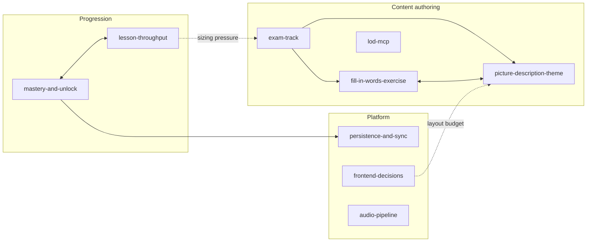

# Project memory — index

**Why this exists:** to record *why* decisions were made, so a future session
doesn't re-litigate a settled question or walk back into a fixed bug. It is not a
description of the code — read the code for that.

Loaded every session. **Read the file whose area you are about to touch**; don't
read them all. This is the canonical location; the home-dir auto-memory is a
redirect and must not be edited.

## Map

| File | Read it before you… |
|---|---|
| [mastery-and-unlock](mastery-and-unlock.md) | touch the pass gate, stat keys, unlock, cursor/frontier, or XP |
| [lesson-throughput](lesson-throughput.md) | change selection buckets, session shape, or lesson sizing |
| [exam-track](exam-track.md) | add a theme, or change the exam catalog/gate |
| [fill-in-words-exercise](fill-in-words-exercise.md) | author or change `@fill` |
| [picture-description-theme](picture-description-theme.md) | author a picture theme, or attach a photo |
| [lod-mcp](lod-mcp.md) | verify Luxembourgish vocabulary |
| [persistence-and-sync](persistence-and-sync.md) | change sync, merge logic, or guest migration |
| [frontend-decisions](frontend-decisions.md) | adopt a React feature, change chunks, SW caching, or the shell layout |
| [audio-pipeline](audio-pipeline.md) | touch audio generation or R2 sync |

**Not here:** the architecture (CLAUDE.md), authoring procedure and bounds (the
`letz-content-generator` skill), the threat model (`.claude/security-plan.md`).

## Writing rules

Save: design rationale · conscious tradeoffs · "we considered X and decided no,
because…" · measurements that justify a choice · traps that cost a debugging
session.

Don't save: anything derivable from current code or `git log` · dates and branch
names · changelogs of when something was fixed · restatements of what a file
already says · ephemeral task state (use `.claude/plans/`, gitignored).

**Update in the same commit** as the change that invalidates a claim. A stale
memory is worse than a missing one — it asserts a wrong fact confidently.

**Merge rather than append.** If a new decision refines an existing one, rewrite
that section; don't stack a "superseded 2026-XX-XX" note on top. The history is in
git.

## Code style

- **No `let`, no `for` loops.** `map`/`filter`/`reduce`/chaining/recursion, in
  every layer — worker, React, utilities. Imperative style only where functional
  becomes genuinely unreadable (almost never).
- **Entry points stay thin** — wiring and routing, no business logic.

## Recording decisions — a correction worth keeping

**Don't convert "X suits Y" into "Y is what X is for."** Told that *B1 content
should lean on `@fill`*, a past session wrote `@fill` up as "the designated home for
B1" across four files. `@fill`'s actual axis is **reuse across topics** and it is
level-independent, so the narrowed version would have suppressed A1/A2 frames —
the opposite of the intent.

When a statement links two things, record the direction actually stated, and check
whether the converse is also being claimed. If it isn't, say so explicitly.
