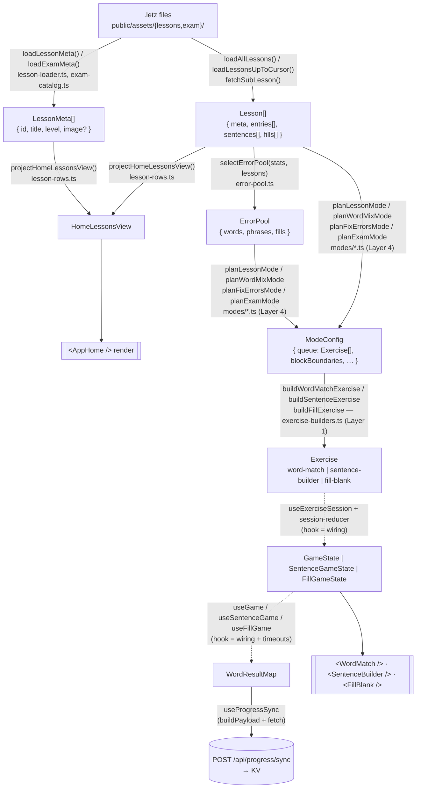
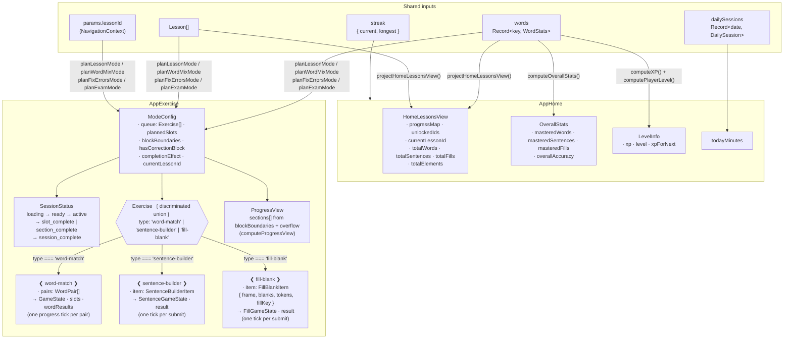

# Data flow — pipeline, rules, and screen data map

Read this before adding, renaming, or moving a producer or data shape anywhere in `src/exercise/`, `src/exam/`, or the page components. **Keep this file accurate every session** — it is loaded on demand (not every session), but it is still the single source of truth for the diagrams; if it drifts, architectural decisions get made from a wrong map.

## Data Pipeline

This codebase is organized as a **producer/consumer pipeline**. Each stage is a pure function that takes named, plain data and returns named, plain data. React, fetch, and KV writes only appear at the **edges**. Stages do not branch on edge cases the previous stage should have handled.

> Diagrams use **Mermaid** (rendered by any markdown viewer that supports it: GitHub, VS Code preview, claude.ai). Use Mermaid for any new architectural diagram in this repo.
>
> **Pick the diagram type that fits the thing being shown.** Mermaid supports many — match the shape of the truth, don't force every diagram into `flowchart`:
> - **`flowchart`** — data flow, dependency graphs, pipelines (this section).
> - **`sequenceDiagram`** — request/response flows, OAuth handshakes, multi-actor protocols.
> - **`stateDiagram-v2`** — state machines (e.g. `SessionStatus`, `SlotState` transitions in `WordMatch`).
> - **`erDiagram`** — KV key shapes and their relationships (`user:{id}` ↔ `email:{email}` ↔ `session:{id}`).
> - **`classDiagram`** — type hierarchies or discriminated-union shapes.
> - **`gantt` / `timeline`** — milestones, release plans, incident timelines.
> - **`journey`** — user-facing flows from the user's perspective.
>
> A sequence diagram squeezed into a flowchart loses the temporal ordering; a state machine drawn as a flowchart hides the cyclic transitions. Choose for clarity, not consistency.



Exercises are built *inside* the planners (one-shot planning), so the `config → exercise` edge is a zoom-in on `ModeConfig.queue`, not a later stage.

Legend: solid arrows = **pure producers** (no React, no I/O). Dashed arrows = **hook wiring** (React state, effects, refs). `[( )]` shapes are side-effect sinks; `[[ ]]` shapes are UI consumers.

Worker side mirrors the same shape: `worker/handlers/*` are thin routers; `worker/lib/user.ts` holds pure data transforms (`mergeWordResults`, `mergeDailySession`); KV is the sink.

## Rules for staying on-pipeline

When you add or change code, preserve the pattern:

1. **Hooks are wiring, not logic.** A `use*` hook should fetch, hold reducer/state, and dispatch — nothing else. If you're tempted to write `if`/`reduce`/`map` chains inside a hook body, extract a pure function and import it.
2. **Pure modules don't import React.** `src/exercise/*.ts` (excluding `use-*.ts`) and `src/lib/*` must not import from `react`, `react-dom`, or hooks. Test by running `grep -l "from \"react\"" src/exercise/*.ts` — should return only `use-*.ts`.
3. **Producers expose named types.** When a producer's output is non-trivial, export the type (`BatchPlan`, `HomeLessonsView`). The type *is* the contract between stages.
4. **Consumers don't re-derive.** If a UI component or hook indexes back into upstream data to figure out what to render (e.g., `pairs[slot.pairIndex]`), that's a smell — but not always worth fixing (see anti-dogmatism rule below).
5. **Side effects sit at the edges.** `loadAllLessons` (fetch), `useProgressSync` (POST), PostHog `capture`, KV writes — these belong at the entry/exit, not threaded through transformations. The one explicit exception is the synchronous PostHog calls inside `useGame`'s click handler; the ordering is intentional and commented.
6. **No `let`, no `for` loops.** Use `map`/`filter`/`reduce`/`flatMap`. The shuffle utility (`src/lib/shuffle.ts`) is the canonical example — there is exactly one shuffle in the app, import it.
7. **Worker handlers stay thin.** `worker/handlers/*.ts` should be: parse request → call pure transform from `worker/lib/*` → write KV → respond. Business logic lives in `worker/lib/`.

## Anti-dogmatism (equally important)

The pipeline is a **conceptual** model, not a syntax rule. Don't:

- Extract a one-line transformation into a producer file just to "make the pipeline explicit." Inline `Object.entries(x).map(...)` is fine.
- Force expression-only code. An internal `for`-equivalent built from `reduce` that's harder to read than a clear inline transform is worse, not better.
- Bundle every field a consumer happens to need into a "view object" producer. That's a viewmodel, and it metastasizes. `HomeLessonsView` is acceptable because it consolidates four redundant `useMemo`s over the same `(lessons, words)` deps; copying that pattern for any future page is not.
- Multiply intermediate allocations on hot paths. The game-state machine fires on every click; don't add layers there without measuring.

If a change feels like it's making the code longer to satisfy the pattern rather than shorter to express the intent, the pattern is wrong for that change.

## Screen Data Map

What each screen receives and from which pipeline stage. Update this when adding a new screen or a new data dependency.



`Lesson[]` is loaded independently on both screens via `loadAllLessons()` (cached by the browser). `words`/`streak`/`dailySessions` come from `useProgress()`, which abstracts over KV (auth) and localStorage (guest). The exam track loads one SubLesson at a time via `src/exam/exam-catalog.ts` instead.

**Session modes** — Home screen exposes three Modes: **Lesson** (default), **Word Mix** (broader pair matching across unlocked words), and **Fix Errors** (drills the user's struggling Elements); the exam theme page starts a fourth, **Exam**. Each is one `modes/*.ts` planner returning a `ModeConfig` consumed by the single Mode-agnostic SessionMachine — see [mode-specs](mode-specs.md) for what each emits.

**Adding a new Exercise type** — see [mode-specs](mode-specs.md) § Adding a new Exercise type for the binding 3-step recipe, and the ⚠️ note there for the wider change a new *Element kind* implies.

## Exercise Session Flow

A Session is one run of a Mode. The orchestrator hook `src/exercise/use-exercise-session.ts` is intentionally thin wiring: it loads lessons, calls the matching Mode planner to produce a queue of Slots (each holding a built Exercise), and dispatches to the SessionMachine reducer. All non-trivial logic lives in pure modules.

The SessionMachine is Mode-agnostic. It walks the Slot queue, emits popup events at Block boundaries (defined per-Mode), and handles the correction Block drain (Lesson and Fix Errors). The re-queue mechanic appends failed SentenceBuilder Slots to the correction Block so they are retried before the Session ends; retry-fails re-enqueue at the back. Per-Element stats (`shown/correct/incorrect`) accumulate per Slot and sync after each Slot group via `useProgressSync` — and, for authenticated users, are also applied locally to `AuthContext` so Home refreshes without a reload (see [mode-specs](mode-specs.md) § Post-Session refresh invariant).

## State Machines

The session and the per-slot games are modeled separately. Two are true state machines (discriminated unions with transition rules); one is an immutable accumulation record with a one-way lock. Don't conflate them.

**SessionStatus** (`src/exercise/session-reducer.ts`) — drives the orchestrator hook.

```
loading → ready → active ⇄ slot_complete       (auto-dismissed; advances slot)
                  active ⇄ section_complete    (user-dismissed milestone at Block boundaries from ModeConfig)
                  active → session_complete    (queue exhausted; correction Block drained if applicable)
loading → error                                (load failure)
```

Transitions are dispatched via `multimethod` keyed on `[action.type, status]`. Section boundaries are **not** computed in the reducer — it reads the `blockBoundaries` array supplied by `ModeConfig`, so Word Mix's three Block boundaries and Lesson's variable-tick layout fall out of one mechanism. The matching UI projection lives in `session-progress.ts` (`computeProgressView`).

**WordMatch SlotState** (`src/exercise/WordMatch/types.ts`, logic in `WordMatch/game-logic.ts`) — per-slot matching game.

- 5 visible slots per side (left: Luxembourgish, right: English)
- Discriminated union: `active → selected → (match | fail) → fading → empty`
- Incorrect matches reset after 1 second
- When a round completes, unmatched pairs reshuffle into remaining fading slots
- Per-word `{shown, correct, incorrect}` accumulates in `GameState.wordResults`

**SentenceGameState** (`src/exercise/SentenceBuilder/types.ts`, logic in `SentenceBuilder/sentence-logic.ts`) — **not** a state machine. It's an immutable accumulation record `{ assembled, checkResult, result }`. `checkResult` (`null → "correct" | "incorrect"`) acts as a one-way lock: once set, `applyTokenTap` / `applyAssembledTap` no-op. The single `result` (`WordResultEntry`) is folded into the session-level `WordResultMap` by `toWordResultMap`. If you need branching mid-puzzle behavior in the future, promote this to a real discriminated union — don't add ad-hoc flags.
