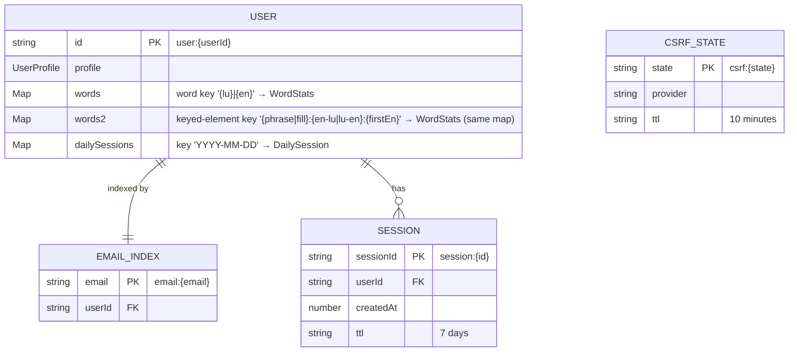

# Data persistence — binding reference

Read this before adding a new KV key, changing a stored shape, altering merge semantics, or introducing a new client-side store. **Keep this file accurate every session** — treat the storage diagram, key shapes, and rules as load-bearing. The *reasoning* behind the fire-and-forget sync, focus-refetch, and migration tradeoffs lives in [persistence-and-sync](../memory/persistence-and-sync.md); this file states the mechanics only.

## Three storage tiers

| Tier              | Backed by              | Authoritative for                       | Lifecycle                          |
|-------------------|------------------------|-----------------------------------------|------------------------------------|
| **Server (KV)**   | Cloudflare KV          | Authenticated users (canonical state)   | Persisted; `user:*` permanent, `session:*` 7d, `csrf:*` 10m |
| **Client (localStorage)** | `localStorage["roude-leiw-guest"]` | Guest users only             | Until login (then migrated + cleared) or manual clear |
| **Client (in-memory)** | React Context (`AuthContext`) + `useSyncExternalStore` over localStorage | Current session view of either tier | Tab lifetime |

## KV key shapes

Two key families share the one `words` map:

- **Word keys** — `'{lu}|{en}'`.
- **Keyed-element keys** — `'{kind}:{direction}:{firstEn}'`, where `kind` ∈ `KEYED_ELEMENT_PREFIXES` (`phrase`, `fill`) and `direction` ∈ `en-lu` | `lu-en`. Direction is part of the key: `phrase:en-lu:…` (assemble the LU answer) and `phrase:lu-en:…` are separate stat rows that mastery sums and the error pool keeps apart.

Use `isWordKey(key)` / `isPhraseKey(key)` / `isFillKey(key)` from `src/exercise/progression.ts` to distinguish them. `isWordKey` is an explicit "matches no known prefix" check — **not** `!isPhraseKey`, which would silently count fills as vocabulary. `elementKey()` (and its `phraseKey`/`fillKey` aliases) truncates `firstEn` to 64 chars to match the server validator's per-part cap (`PHRASE_KEY_RX` / `FILL_KEY_RX`); elements sharing the same first 64 chars collide onto one key by design, and `tests/integration/fill-content-rules.test.ts` fails the build if authored content actually collides.

Schemas live in `worker/types.ts` (`UserData`, `WordStats`, `DailySession`, `SessionData`). KV CRUD lives in `worker/lib/user.ts` and `worker/lib/session.ts`.

## Core principles

1. **Derive, don't store.** Anything computable from `words` + `dailySessions` is computed on the fly:
   - **Streaks** ← `computeStreak(dailySessions, today)` in `worker/lib/user.ts`. No `streak` field.
   - **Lesson completion** ← `computeLessonProgress(lesson, words)` in `src/exercise/progression.ts`. No `completedLessons` field.
   - **Lesson unlock** ← `computeUnlockedLessonIds(lessons, words)`. No `unlockedLessons` field.
   - **Mastery class** (unseen/learning/struggling/mastered) ← `classifyWord(stats)`, which uses **live accuracy** plus `MIN_ANSWERS` and can fluctuate. Do **not** confuse it with the monotonic pass gate `isElementMastered` (`correct >= MASTERY_CORRECT_COUNT`); the two answer different questions and both apply to every key family. See [mastery-and-unlock](../memory/mastery-and-unlock.md).
   - If you're tempted to add a new "summary" field to KV, ask whether it's a function of existing data. It almost always is.

2. **Send deltas, not snapshots.** The client posts a *batch* (`POST /api/progress/sync` body = what happened in this batch only). The server folds the delta into the cumulative `words` + `dailySessions`. Do not POST the full client snapshot.

3. **Same merge logic on both sides.** The same fold runs server-side (`mergeWordResults`/`mergeDailySession` in `worker/lib/user.ts`) and client-side for guest mode (`mergeWordStats`/`mergeDailySession` in `src/lib/stats-merge.ts`). The duplication is intentional — guest mode must produce a state that, when migrated, is byte-identical to what the server would have produced from the same deltas. **If you change one, change both** and verify with the existing tests in `tests/worker/lib/user.test.ts`.

4. **Single JSON blob per user.** `user:{userId}` holds `{ profile, words, dailySessions }` together. Don't split into separate keys ("user:{id}:words", "user:{id}:sessions") — the worker reads/writes atomically and the blob is small. This is a deliberate constraint, not a limitation to work around.

5. **Sync is fire-and-forget.** `useProgressSync` POSTs without awaiting a result for the UI flow. There's no retry, no idempotency key — if the request fails, the next batch's POST will include only that batch's delta, so failures lose data. Acceptable today (small data, infrequent loss); revisit if loss becomes user-visible.

6. **Sessions and CSRF use TTLs, not deletion sweeps.** Cloudflare KV `expirationTtl` handles cleanup. Don't write background jobs to expire stale rows.

7. **`unlockedLessons` doubles as the exam played-SubLesson set.** Exam SubLesson manifest ids (e.g. `vacation.01`) are pushed through the same `newlyUnlockedLessons` channel when an exam Session completes — course logic only ever looks up course ids, exam logic only exam ids, so the two id families coexist inertly in one array and guest→auth migration carries both for free. Don't add a separate `playedSubLessons` field.

8. **Guest store mirrors the auth schema; migration is chunked, clear-on-success.** `GuestData = { words, dailySessions, unlockedLessons }` (`UserData` minus `profile`). Lifetime guest totals routinely exceed the per-request validator bounds, so `buildMigrationChunks` (`src/persistence/migration.ts`, pure) splits them into in-bounds payloads that reconstruct exact totals via the additive server merge. Chunks POST sequentially; `localStorage` clears **only when every chunk succeeded**. See [persistence-and-sync](../memory/persistence-and-sync.md) for the accepted failure-mode tradeoffs (partial-chunk double-count, streak-history loss on migration).

## Client read/write pattern

`useProgress` (`src/persistence/hooks/use-progress.ts`) is the single read entry point — it returns `{ words, dailySessions, streak, syncBatch, isAuthenticated }` regardless of auth status. Consumers never branch on `auth.status` themselves; that's `useProgress`'s job.

The guest path uses `useSyncExternalStore` (`use-guest-progress.ts`) instead of `useState`/`useEffect`, because:
- Writes to localStorage are deliberately silent (no re-render storm during a batch).
- React re-reads only when explicitly notified via `refreshGuestProgress()` (called on navigation/session-end).
- Rationale: data updates fire on every match; rendering on every match would thrash. Render boundaries are coarser than data boundaries.

If you add a new client-side store: prefer `useSyncExternalStore` over `useState`+effects when writes are frequent or come from outside React.

## Adding new persisted data — checklist

Before adding a new field to `UserData` or a new KV key:

- [ ] Can this be **derived** from existing data? If yes, write a pure function in `worker/lib/` or `src/exercise/progression.ts` instead.
- [ ] If new field added: update `worker/types.ts`, both merge functions (`worker/lib/user.ts` + `src/lib/stats-merge.ts`), the guest-store schema, and the migration path in `useProgress`.
- [ ] If new KV key added: update the er diagram above, set an explicit `expirationTtl` if not permanent, document the key prefix.
- [ ] Add a test in `tests/worker/lib/user.test.ts` covering the new merge case (these tests are the only guarantee that guest and auth paths stay in sync).
