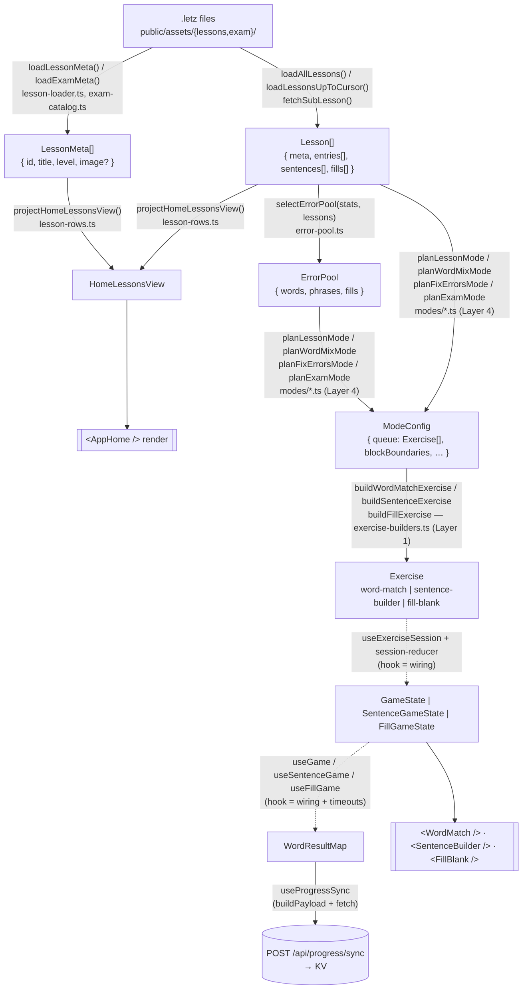
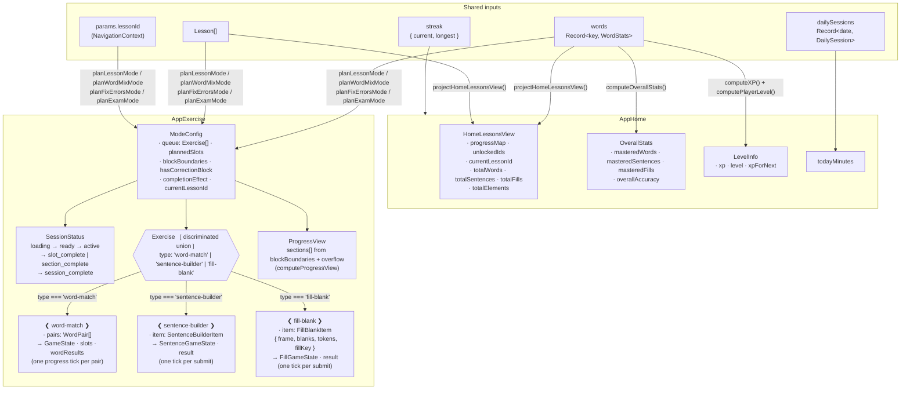
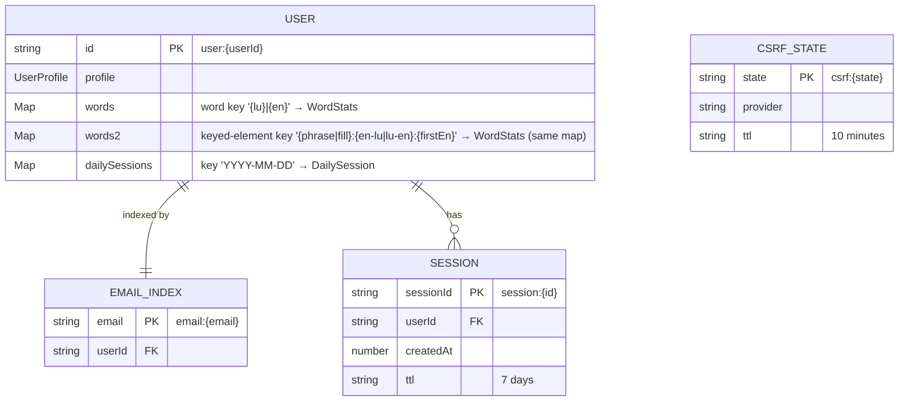

# CLAUDE.md

This file provides guidance to Claude Code (claude.ai/code) when working with code in this repository. At the end of every development, check if there was anything worth writing to MEMORY.md (see details in "Memory — required reading and writing" section).

## Commands

```bash
npm run dev          # Start Vite dev server (includes local worker + KV emulation)
npm run build        # vitest run && eslint . && tsc -b && vite build
                     # Tests, lint, and typecheck must all pass before bundling.
npm run lint         # ESLint
npm run preview      # Preview production build locally
npm run deploy       # Build and deploy to Cloudflare Pages

npm run generate-audio    -- <path-to-lesson.letz>   # ElevenLabs TTS for @lu phrases
npm run sync-audio:upload -- [path]                  # push local mp3s to R2
npm run sync-audio:download -- [path]                # pull mp3s from R2 (auto-runs in prebuild)
```

Audio files are gitignored. R2 is the source of truth. See [`.claude/memory/audio-pipeline.md`](./.claude/memory/audio-pipeline.md) for the full design.

Tests run with `npx vitest run` (config in `vitest.config.ts`). Tests live under `tests/` mirroring the source tree. See **Testing** in Architecture below for what's covered and the no-mocks rule.

## What This App Is

**Roude Leiw** is a Luxembourgish language learning SPA. Users match Luxembourgish words to their English translations across levels (A1–C2), build sentences from token tiles, and revisit content they've struggled with. There are three exercise Modes from the Home screen: **Lesson** (focused practice within one lesson and its prerequisites), **Word Mix** (broader pair matching across all unlocked words), and **Fix Errors** (drills on the user's struggling Elements).

A separate **Exam track** ("Sproochentest Prep", reachable from Home) prepares for the Luxembourgish citizenship speaking exam. It is theme-scoped (Vacation, Family, … — mirroring the Sproochentest/TWAL oral-exam topics), has no level dimension, and progresses Duolingo-style: each Theme is a short path of SubLessons (vocabulary → phrases → Q&A) unlocked sequentially — a SubLesson opens the next one once it is **fully passed**, the same mastery gate the course track uses between lessons. Exam content is a parallel catalog — it never enters Word Mix or Home's stats. **Fix Errors is the one global Mode**: its error pool spans both tracks (course lessons + played/unlocked exam SubLessons).

Deployed to Cloudflare Pages with a Cloudflare Worker backend for auth and persistence.

## Tech Stack

- React 19 + TypeScript (strict) + Tailwind CSS 4
- Vite 7 with `@cloudflare/vite-plugin` + Babel React Compiler (automatic memoization)
- Chevrotain 11 for parsing `.letz` lesson files
- Cloudflare Workers (backend API) + KV (persistence + sessions)
- Google OAuth 2.0 for authentication

## Glossary (binding vocabulary)

This is the canonical vocabulary for the exercise/session system. Use these terms in code, comments, PR descriptions, and conversation; the "Retired terms" list at the bottom names the legacy words they replaced.

**Content tier** — static, read-only.

| Term | Meaning |
|---|---|
| Manifest | Catalog index `{ levels: [{ id, lessons: [{ id, title, file }] }] }`. Title field is part of the target manifest. |
| Lesson | One `.letz` file's parsed content. `{ meta, entries[], sentences[], fills[] }`. |
| LessonMeta | Light catalog row used by Home (`{ id, title, level }`, plus optional `image`/`imageAlt`); no words/sentences/fills. Loaded from manifest only. |
| Word | A `{ lu, en }` pair. |
| Sentence | A translatable phrase + accepted answers + distractors; may carry a `question` (examiner prompt, exam track). |
| Fill | A `@fill` block: one LU line and one EN line, each with `[bracketed]` blanks, plus per-language distractors. **One blank = one tile, verbatim** (never tokenized). |
| Element | Umbrella for Word, Sentence, or Fill (used uniformly by unlock %, error pool, stats). |
| Theme | Exam-track topic (e.g. Vacation) from `public/assets/exam/manifest.json`. No level; manifest order is display order. |
| SubLesson | One step of a Theme's path. Content-wise a `Lesson` (one `.letz` file); identity is the **manifest** id (e.g. `vacation.01`), the in-file `@lesson` id is only a label. |

**Progression tier** — persisted user state.

| Term | Meaning |
|---|---|
| Stats | `{ shown, correct, incorrect }` per element key. |
| Daily activity | `Record<YYYY-MM-DD, { durationSeconds }>`. |
| Streak | Derived from daily activity. |
| Cursor | The lesson a Session focuses on: **first unlocked lesson that has not passed** (`findCurrentLessonId`); derived. |
| Frontier | Max unlocked lesson id (`findFrontierLessonId`); derived. Bounds a *pool*, never the focus — sticky unlock lets it sit above unfinished lessons. |
| Error pool | Derived set of struggling elements (see **Centralized error pool** below). |

**Runtime tier** — ephemeral, one Session of work.

| Term | Meaning |
|---|---|
| Mode | `lesson \| word-mix \| fix-errors \| exam`. Picked at Home (exam: via the theme page). |
| Session | One top-level run of a Mode. |
| Block | A chunk of a Session. Lesson/fix-errors = 3 normal + ≤1 correction. Word-mix = 3. |
| Slot | One unit of work inside a Block. Holds one Exercise. |
| Exercise | The mechanic in a Slot. `word-match \| sentence-builder \| fill-blank \| …` (plug-in seam). |
| Step | Smallest user action inside an Exercise. WordMatch = one pair; SentenceBuilder and FillBlank = one submit. |

**Retired terms — do not use in new code:** `batch` (use Slot or Exercise), `madness` (use word-mix), `mistakes mode` (use fix-errors), `game` when ambiguous (use Exercise for the mechanic or Session for the run).

## Project Structure

```
src/
├── main.tsx                          # App entry point (React root + providers)
├── App.tsx                           # Root component, page routing
├── App.css                           # Global app styles
├── index.css                         # Tailwind imports & theme config
│
├── context/                          # App-wide state (React Context)
│   ├── navigation.ts                 # Types: AppPages, NavigationContext
│   ├── NavigationContext.tsx         # Navigation provider
│   ├── useNavigation.ts              # Hook: useNavigation()
│   ├── auth.ts                       # Types: User, AuthState, AuthContextType
│   ├── AuthContext.tsx               # Auth provider (fetches /api/auth/me on mount)
│   └── useAuth.ts                    # Hook: useAuth()
│
├── page/                             # Top-level page components
│   ├── AppHome.tsx                   # Home/lesson selection page
│   ├── AppExam.tsx                   # Exam-track theme page (Sproochentest Prep)
│   └── AppExercise.tsx              # Exercise/game page (wires progress sync)
│
├── exam/                             # Exam track — parallel to the course catalog
│   ├── exam-catalog.ts               # ExamManifest/SubLessonMeta types + loaders (theme-first, no level)
│   └── exam-progression.ts           # Pure: computeExamView (pass-gate unlock), selectSubLessonsToLoad
│
├── exercise/                         # Core game logic — producer pipeline (see Glossary for terms)
│   ├── use-exercise-session.ts       # Hook: thin wiring (load + dispatch only)
│   ├── lesson-loader.ts              # Producer: manifest → LessonMeta[] (cheap); .letz files → Lesson (lazy, per Session)
│   ├── letz-parser.ts                # Facade: entriesToWordPairs()
│   ├── constants.ts                  # All mode/slot/threshold constants — no magic numbers below this
│   ├── mode-config.ts                # Layer 3 contract: SessionMode, ModeConfig, CompletionEffect types
│   ├── session-reducer.ts            # SessionMachine reducer (Mode-agnostic)
│   ├── session-progress.ts           # Pure producer: computeProgressView(blockBoundaries)
│   ├── error-pool.ts                 # Layer 0: selectErrorPool(stats, lessons) → { words, phrases, fills }
│   ├── error-scope.ts                # Producer: loadErrorScopeLessons — global (course + played/unlocked exam) pool
│   ├── lesson-image.ts               # Pure: resolveLessonImage (@image/@image-alt → src or text placeholder)
│   ├── selection.ts                  # Layer 1: bucketedPick, pickPair, pickSentence, pickFill primitives
│   ├── exercise-builders.ts          # Layer 1: buildWordMatchExercise, buildSentenceExercise, buildFillExercise,
│   │                                 #          tokenizeSentence, parseFillLine, stripBlankMarkers
│   ├── types.ts                      # Exercise discriminated union (word-match | sentence-builder | fill-blank)
│   ├── progression.ts                # Pure derivations: classifyWord, computeLessonProgress, computeUnlockedLessonIds
│   ├── lesson-rows.ts                # Producer: (lessons, userWords) → HomeLessonsView
│   ├── modes/                        # Layer 4 — Mode planners (each returns ModeConfig)
│   │   ├── lesson.ts                 # planLessonMode(lessons, upperBoundId) → ModeConfig
│   │   ├── word-mix.ts               # planWordMixMode(lessons, stats) → ModeConfig
│   │   ├── fix-errors.ts             # planFixErrorsMode(lessons, stats) → ModeConfig
│   │   └── exam.ts                   # planExamMode(subLesson) → ModeConfig (chunk + shuffle, no stats)
│   ├── FillBlank/                    # Fill-in-words game (one tile per blank)
│   │   ├── index.tsx                 # Game UI (gapped frame + tile pool)
│   │   ├── use-fill-game.ts          # Wiring: state + result tracking
│   │   ├── types.ts                  # FillGameState (placed[], selectedBlank, checkResult, result)
│   │   └── fill-logic.ts             # Pure logic: initFillGame, targetBlank, applyTokenTap,
│   │                                 #   applyBlankTap/Clear, applySubmit, toWordResultMap, correctSentence
│   ├── SentenceBuilder/              # Sentence assembly game
│   │   ├── index.tsx                 # Game UI (token tiles + assembled area)
│   │   ├── use-sentence-game.ts      # Game state machine + result tracking
│   │   ├── types.ts                  # SentencePuzzle, TokenState, SentenceGameState
│   │   └── sentence-logic.ts        # Pure logic: initSentenceGame, applyTokenTap, applySubmit, toWordResultMap
│   └── WordMatch/                    # Matching game
│       ├── index.tsx                 # Game UI (left/right columns)
│       ├── use-game.ts               # Game state machine + word result tracking
│       └── types.ts                  # WordPair, SlotState, GameState, WordResultMap
│
├── persistence/                      # Backend sync
│   ├── migration.ts                  # Pure: buildMigrationChunks — splits guest totals into validator-bound sync payloads
│   └── hooks/
│       └── use-progress-sync.ts      # Syncs word results to /api/progress/sync (returns success boolean)
│
├── lib/                              # Shared libraries
│   ├── shuffle.ts                    # Single Fisher–Yates shuffle for the whole app
│   ├── streak.ts                     # Shared computeStreak — imported by both worker and client
│   ├── stats-merge.ts                # Client-side mergeWordStats/mergeDailySession (mirrors worker merge)
│   └── letz-parser/                  # Chevrotain parser implementation
│       ├── index.ts                  # Main exports
│       ├── lexer.ts                  # Tokenizer
│       ├── parser.ts                 # Grammar definition
│       └── visitor.ts                # AST visitor → structured data
│
└── ui/                               # Reusable UI components
    ├── index.ts                      # Barrel exports + color maps
    ├── AppWrapper.tsx                # App shell (header, mobile frame, wraps AuthProvider)
    ├── UserMenu.tsx                  # Sign-in button / user avatar
    ├── Button.tsx                    # Primary action button
    ├── Pill.tsx                      # Status pill (blanc/selected/success/fail)
    ├── FadingPill.tsx                # Pill with fade-out animation
    ├── ProgressBar.tsx               # Segmented batch progress indicator
    ├── SubLessonPath.tsx             # Exam theme path (vertical node list, play/lock states)
    └── Popup.tsx                     # Modal (milestone & celebration variants)

worker/
├── index.ts                          # Worker entry point (thin: router wiring only)
├── router.ts                         # Table-driven router + session middleware
├── types.ts                          # Shared types (Env, UserData, KV shapes, API types)
├── handlers/
│   ├── auth.ts                       # Google OAuth handlers (initiate, callback, me, logout)
│   └── progress.ts                   # Progress sync handler
└── lib/
    ├── session.ts                    # KV session CRUD + cookie helpers
    ├── user.ts                       # KV user CRUD + pure data transforms (merge, streak)
    └── oauth/
        ├── types.ts                  # OAuthUserInfo type
        └── google.ts                 # Google OAuth (auth URL + code exchange)

public/
└── assets/
    ├── lessons/
    │   ├── manifest.json             # Course index by CEFR level → sections → lessons
    │   └── A1/A1.1/*.letz            # Course content (A1 lessons)
    └── exam/
        ├── manifest.json             # Exam index: themes → subLessons; each theme has
        │                             #   kind: "topic" | "picture" (no level dimension)
        ├── vacation/*.letz           # topic theme: 01_vocabulary, 02_phrases, 03_questions
        ├── family/*.letz             # same three-step pattern per topic theme
        └── picture/                  # picture themes — one directory per photo
            └── schueberfouer/
                ├── 0{1,2,3}_*.letz   # general / people / weather, all describing one photo
                └── img/*.webp        # optimized: 16:9, ≤880px (see memory for the recipe)
```

## Architecture

### Architecture Reference (binding model)

This subsection is the load-bearing reference for the exercise/session system. The diagrams further down (Data Pipeline, Screen Data Map) show the same model as a data-flow view. **If they ever disagree, this section wins** and the diagrams are the ones to fix.

#### Encapsulation layering

```
Layer 4: Mode planners              planLessonMode, planWordMixMode, planFixErrorsMode
                                     ↓ produce
Layer 3: SessionMachine              one reducer (Block/Slot transitions, popups)
                                     ↓ consumes
Layer 2: Exercises (plug-in)         WordMatchExercise, SentenceBuilderExercise, …
                                     ↓ built from
Layer 1: Selection primitives        bucketedPick(roll, buckets), pickPair, pickSentence,
                                     buildWordMatchExercise, buildSentenceExercise,
                                     chunkIntoWordMatchExercises, resolveSentenceDirection
                                     ↓ reading from
Layer 0: Pure derivations            selectErrorPool, classifyElement, computeCursor,
                                     unlockedSet, MIN_ANSWERS, thresholds
```

**Each layer imports only from layers below it.** The only place that knows which buckets feed which Exercise type is Layer 4 (the Mode planners). The SessionMachine (Layer 3) is Mode-agnostic — it walks a queue of pre-built Exercises and emits popup events at Block boundaries.

#### Pipeline alignment invariants

Four rules that must hold across this architecture (in addition to the Data Pipeline rules in the next subsection):

1. **One-shot planning.** Mode planners run once at Session start, read a stats snapshot, and emit a complete `ModeConfig` with every Slot's Exercise pre-built. Mid-Session events update global Stats (sink) but do **not** re-enter the planner. Planners are stateless producers; the SessionMachine is a stupid consumer.
2. **No callbacks across layer boundaries.** `ModeConfig.completionEffect` is a plain enum tag (`'unlock-check' | 'noop'`), not a function. The wiring hook (`use-exercise-session`) reads the tag and invokes the relevant pure derivation plus the relevant edge action (navigation, refresh). No layer hands a closure to a layer above it.
3. **Named typed data is the only stage contract.** Anything crossing a layer boundary must be a plain typed value with an exported type. No shared mutable state, no implicit ordering.
4. **Progress tick granularity is owned by Exercise, not Mode.** WordMatch emits a tick per Step (per pair); SentenceBuilder emits a tick per Slot (per submit); future Exercises declare their own. Total progress bar size for a Session = sum of each Slot's `exerciseTickCount`. Block boundaries on the bar are placed at the cumulative tick count where each Block ends.

#### Mode specs

All three Modes share the same SessionMachine; they differ only in what `ModeConfig` they emit.

**Lesson** — `planLessonMode(lessons, stats, upperBoundId)`.
- Shape: `BLOCK_COUNT` Blocks × `LESSON.slotsPerBlock` Slots + optional correction Block.
- Slot type roll: **adaptive**, not fixed — `lessonSlotTypeDistribution` scales the word-match share with how word-heavy the current lesson's remaining backlog is, clamped by `LESSON.wordMatchShare`. See [lesson-throughput](.claude/memory/lesson-throughput.md) for why.
- Upper bound is a single lesson id, compared **lexicographically**; pool = all lessons where `lesson.id <= upperBoundId`. "Start Learning" sets it to the **cursor** — the first unlocked lesson that has not passed, *not* the frontier; picking a specific lesson sets it to that lesson (clamps the pool — picking A1.03 when A1.05 is unlocked draws only from A1.01–A1.03). The clamp is load-bearing: the straggler apparatus (not-yet-mastered bucket + adaptive slot-type split) is scoped to the pool's last lesson, so a frontier-based bound left every earlier unfinished lesson reachable only via the thin `previous` bucket.
- WordMatch Slot: `LESSON.wordMatchPairs` pairs, each drawn by an independent roll over the **three** `LESSON.buckets.wordMatch` buckets — `not-yet-mastered` (current-lesson Elements below the gate) first, then `current`, then `previous`. Re-roll on empty bucket.
- SentenceBuilder Slot: same three-bucket shape via `LESSON.buckets.sentenceLesson`; random phrase within the picked lesson; direction from `LESSON.buckets.direction`.
- **Bucket weights live in `constants.ts` — read them there.** They are tuned per-Mode and change; restating them here has drifted before.
- Outcomes: WordMatch always success (failed pairs → stats only). SentenceBuilder fail → enqueue Slot into correction Block.
- Correction Block: retry queued Slots; retry-fail re-enqueues at back; drain to empty.
- Popups: block-success (after Blocks 1 & 2), session-success (after Block 3 if queue empty, or after correction drain). Every Session ends in success after drain.
- `completionEffect: 'unlock-check'` — wiring hook runs `unlockedSet` after Stats sync.
- **Does not schedule fill-blank Slots.** A lesson's `@fill` Elements therefore never pass the unlock gate from Lesson Mode alone — which is why no course `.letz` carries `@fill` today. Adding one means adding a fill bucket to this planner in the same change, or the lesson becomes unpassable.

**Word Mix** — `planWordMixMode(lessons, stats, persistedUnlocked)`.
- Shape: 3 Blocks × 1 Slot per Block. Each Slot = a WordMatch Exercise of `WORD_MIX.pairsPerSlot` pairs (one Step per pair). No correction Block.
- Pool: all words from lessons up to and including the **frontier** (review must keep covering passed lessons). The `current` bucket, however, is the **cursor** — so the bias lands on the lesson the user is stuck on, while `previous` means "everything else in the pool" (which can include lessons *after* the cursor).
- Per-pair bucket roll, applied independently for **every** pair at plan time over `WORD_MIX.buckets.pairSource`: error pool / current-lesson / previous-lessons. Re-roll on empty. Weights are in `constants.ts`.
- One-shot plan; mid-Session results do not re-bucket later pairs.
- Popups: only on Slot/Block complete (3 total — Slot boundary = Block boundary).
- `completionEffect: 'noop'`.
- Progress bar: one tick per pair across the whole Session, with a milestone at each Slot boundary.
- Words only — Word Mix is pair matching by definition, so it schedules no sentence-builder or fill-blank Slots.

**Fix Errors** — `planFixErrorsMode(lessons, stats, persistedUnlocked)`.
- **Global scope**: `lessons` = all course lessons + exam SubLessons in error scope (played or unlocked — see `loadErrorScopeLessons` in `src/exercise/error-scope.ts`). The planner itself is track-agnostic; the call sites decide the scope. A failed exam Q&A phrase is rebuilt with its `question` in the failed direction.
- Home button disabled when error pool is empty (same global scope via `loadExamErrorLessons`).
- Same Session shape as Lesson (`LESSON.totalSlots` + optional correction). **Its own three-way slot-type roll** (`FIX_ERRORS.buckets.slotType`) — word-match / sentence-builder / fill-blank, **fixed**, not adaptive like Lesson's, because its backlog is by definition all struggling Elements. Fill's share is carved out of sentence-builder's, not word-match's.
- The one Mode that draws from all three error pools — it is where a failed `@fill` gets retried, since neither Lesson nor Word Mix schedules one.
- WordMatch Slot: `LESSON.wordMatchPairs` pairs drawn independently **with replacement** from the word-error pool (duplicates allowed).
- SentenceBuilder Slot: 1 `PhraseError` from sentence-error pool — presented in the **same direction the user failed** (the pool entry carries its direction; no direction roll here).
- FillBlank Slot: 1 `FillError` from the fill-error pool, same failed-direction rule.
- Empty pool for rolled type → re-roll a bounded number of times, then a fixed-order fallback (word → sentence → fill) so a Session still fills when only one pool has content. **A builder must check its pool before consuming any rng** — otherwise a re-roll shifts every later draw and `fakeRng` tests stop describing real Sessions.
- Outcomes & correction Block: identical to Lesson.
- `completionEffect: 'noop'`.

**Exam** — `planExamMode(subLesson)`.
- Input: ONE SubLesson's `Lesson` (loaded via `src/exam/exam-catalog.ts`, never `loadAllLessons`). No stats input — the plan is content-deterministic ("we only shuffle it").
- Shape: every Element exactly once. Words: shuffled, then `chunkIntoWordMatchExercises` (shared Layer 1) with `EXAM.wordMatch` sizing — `pairCount` pairs per Slot, and a trailing chunk below `minChunk` merges into the previous Slot rather than forming a degenerate one. Sentences: one SentenceBuilder Slot each. Fills: one FillBlank Slot each. Combined Slot list shuffled.
- Direction: rolled with the Lesson direction table, then normalized by `resolveSentenceDirection` — a Sentence carrying `question` is **always** en→lu. That rule is Layer 1, not Mode-specific, so course lessons using `@question` behave identically. Fills roll from the same table with nothing to override it (a `@fill` never carries `@question`).
- Elements missing a line on either side (`@lu` or `@en` empty) are skipped rather than planned as a broken Slot — applies to both sentences and fills.
- Block boundaries: `BLOCK_COUNT` near-equal cuts over the queue (deduped for tiny queues). Correction Block: yes (same re-queue mechanic as Lesson).
- Outcomes: same as Lesson. `completionEffect: 'noop'`.
- Pass-gate: `computeExamView` (`src/exam/exam-progression.ts`) unlocks the next SubLesson in a Theme once the previous one is **passed** — `computeLessonProgress(...).isComplete`, i.e. every Element at `correct >= MASTERY_CORRECT_COUNT`. Same gate and same constant as the course track. `passed` implies `unlocked`, so the chain advances exactly one step at a time.
- Played-marker (edge, in `AppExercise.flushProgress`): a **completed** exam Session pushes its SubLesson's manifest id through `newlyUnlockedLessons`; abandoning marks nothing. That id no longer opens the next step — it keeps the SubLesson unlocked (sticky access) and puts it in the content-load / error-pool scope.

#### Unlock rule (both tracks)

One rule gates progression on the course track (lesson → next lesson) and on the exam track (SubLesson → next SubLesson in its Theme). For each Element defined in the lesson's `.letz` file:
- Element passes iff `correct >= MASTERY_CORRECT_COUNT`. There is **no** accuracy ratio and **no** minimum-shown gate — enough correct answers passes the Element regardless of how many times it was missed (`isElementMastered` in `progression.ts`).
- For a **Sentence**, the two presentation directions are summed first: a phrase passes iff `enLu.correct + luEn.correct` clears the same constant (`combinedElementStats`). Both directions count toward the one phrase Element.

The lesson unlocks the next lesson iff `passingElements / totalElements >= UNLOCK_LESSON_THRESHOLD` — currently **1.0**, i.e. every Element must pass (see [mastery-and-unlock](.claude/memory/mastery-and-unlock.md)). Read the value from `constants.ts`; the fact that it *is* 1.0 is load-bearing for content sizing, so it is stated once here and nowhere else.

Unlock is **sticky**: `correct` is monotonic, so once a lesson passes the threshold it stays unlocked without storing an `unlockedLessons` set. Don't introduce one; deriving from stats stays correct as long as stats are append-only.

> `MIN_ANSWERS` still gates the **live** `classifyWord` label and the error pool — not the pass gate. The two systems are intentionally separate (see [mastery-and-unlock](.claude/memory/mastery-and-unlock.md)).

#### Centralized error pool

`selectErrorPool(stats, lessons)` returns `{ words, phrases, fills }`. **Single source of truth** for "struggling content" across the app — Fix Errors planner consumes all three pools; Word Mix planner consumes `words` for its `[0, 0.25]` bucket; future features that need "things the user is bad at" consume the same function.

The function is scope-agnostic: the `lessons` argument defines the scope. Fix Errors passes the **global** scope (course + exam, via `src/exercise/error-scope.ts`); Word Mix passes course-lessons-up-to-frontier only.

`phrases` is `PhraseError[]` and `fills` is `FillError[]` — each entry is `{ sentence | fill, direction }` keyed by its **directional** stat key, so an element failed in `en-lu` and the same element failed in `lu-en` are distinct error entries. Fix Errors rebuilds the exact failed direction. (Mastery sums the directions; the error pool keeps them apart — this is deliberate.)

- Primary: elements with `shown >= MIN_ANSWERS` AND `correct / (correct + incorrect) < ERROR_THRESHOLD`.
- Fallback (when primary is empty): all elements with `incorrect > 0`, worst accuracy first.

The accuracy formula is the same one `classifyWord` uses — **not** `correct/shown`. Read the value of `ERROR_THRESHOLD` from `constants.ts`; don't restate it here.
- The three kinds are **independent**: each computes its own primary/fallback, so a struggling fill surfaces even when the word pool's primary criteria are already satisfied. A phrase and a fill sharing the same English text are distinct Elements — the key prefix separates them.

Do not re-implement this rule inline; if you need a different definition, add a separate named function in the same module — don't fork.

#### Post-Session refresh invariant

**The auth and guest progress paths must produce byte-identical local state and must both refresh Home without a page reload after a Session completes.**

- **Guest path:** `useGuestProgress` writes to localStorage; `AppExercise.goHome()` calls `refreshGuestProgress()` to notify subscribers; Home re-reads and re-renders.
- **Auth path:** `useProgress.syncBatch` applies the same client-side `mergeWordStats`/`mergeDailySession` (`src/lib/stats-merge.ts`) to `AuthContext` state optimistically before POSTing to `/api/progress/sync`. `computeStreak` (shared between worker and client in `src/lib/streak.ts`) is re-run on the locally-merged daily activity. The POST stays fire-and-forget; the local merge is the byte-identical mirror of the server merge that runs in `worker/lib/user.ts`.

If you change the merge logic on one side (worker or client), change it on the other side in the same commit. The byte-identity test in `tests/src/context/auth-stats-delta.test.ts` is the guarantee.

#### Adding a new Exercise type

Three touch points, nothing else:
1. **Type:** extend the `Exercise` union in `src/exercise/types.ts` with the new variant (`{ type: 'fill-blank', … }`).
2. **Logic + UI:** add `src/exercise/<NewType>/` containing the pure logic module and the React component, parameterized by the variant's data shape. Declare the Exercise's progress tick rate (per-Step or per-Slot) at the same time.
3. **Router:** add a `currentExercise?.type === 'fill-blank' && <FillBlank … />` branch in `src/page/AppExercise.tsx`.

The SessionMachine and Mode planners are untouched. If a Mode wants to schedule the new Exercise type in its Slots, the matching Mode planner adds a builder call (the only place that knows which Exercises feed which Modes).

> ⚠️ **This recipe covers a new *mechanic* over existing content.** A new Exercise type that also introduces a new **Element kind** (a new `.letz` block with its own stat key) is a much wider change — it ripples far past the three touch points, because `Lesson.<newKind>` reaches the parser (`lexer.ts`/`parser.ts`/`visitor.ts`), `progression.ts` (`collectLessonKeys`, `computeLessonProgress`, mastery, `computeOverallStats`), `error-pool.ts`, `lesson-rows.ts`, the Mode planners, `worker/lib/validators.ts`, and every matching test. `@fill` was the first such addition (Aug 2026) and it paid down the two traps this note used to warn about:
>
> - **Key family, not copy-paste.** `KEYED_ELEMENT_PREFIXES` in `progression.ts` drives `elementKey`/`combinedElementStats`/`elementIdentity`, and `isWordKey` is an explicit "matches no known prefix" check (**never** `!isPhraseKey` — that miscounts every new prefix as vocabulary and inflates `totalWords`/`masteredWords` on Home). Adding a third keyed kind means adding one string to that list, plus a thin named alias if the call sites read better for it.
> - **Validator first.** `worker/lib/validators.ts` must admit the new key prefix in `isValidKey`, with a test. Miss it and the server rejects **the entire sync batch** containing one such result — not graceful degradation but silent total progress loss for that Session.
>
> See [fill-in-words-exercise](.claude/memory/fill-in-words-exercise.md) for the full record, including which ambiguity rules a new content-bearing kind should enforce in `tests/integration/`.

### Data Pipeline (read this first)

This codebase is organized as a **producer/consumer pipeline**. Each stage is a pure function that takes named, plain data and returns named, plain data. React, fetch, and KV writes only appear at the **edges**. Stages do not branch on edge cases the previous stage should have handled.

> ⚠️ **Keep this section accurate every session.** When you add, rename, move, or remove a producer or data shape, update the diagram and the rules below in the same change. This file is loaded as context for every Claude Code session — if it drifts, all future architectural decisions are made from a wrong map. Treat the diagram as load-bearing, not documentation.
>
> Diagrams use **Mermaid** (rendered by any markdown viewer that supports it: GitHub, VS Code preview, claude.ai). Use Mermaid for any new architectural diagram in this repo.
>
> **Pick the diagram type that fits the thing being shown.** Mermaid supports many — match the shape of the truth, don't force every diagram into `flowchart`:
> - **`flowchart`** — data flow, dependency graphs, pipelines (this section).
> - **`sequenceDiagram`** — request/response flows, OAuth handshakes, multi-actor protocols (e.g. the auth flow below would render well as one).
> - **`stateDiagram-v2`** — state machines (e.g. `SessionStatus`, `SlotState` transitions in `WordMatch`).
> - **`erDiagram`** — KV key shapes and their relationships (`user:{id}` ↔ `email:{email}` ↔ `session:{id}`).
> - **`classDiagram`** — type hierarchies or discriminated-union shapes.
> - **`gantt` / `timeline`** — milestones, release plans, incident timelines.
> - **`journey`** — user-facing flows from the user's perspective.
>
> A sequence diagram squeezed into a flowchart loses the temporal ordering; a state machine drawn as a flowchart hides the cyclic transitions. Choose for clarity, not consistency.



Exercises are built *inside* the planners (one-shot planning), so the `config → exercise` edge is a zoom-in on `ModeConfig.queue`, not a later stage.

Legend: solid arrows = **pure producers** (no React, no I/O). Dashed arrows = **hook wiring** (React state, effects, refs). `[( )]` shapes are side-effect sinks; `[[ ]]` shapes are UI consumers.

Worker side mirrors the same shape: `worker/handlers/*` are thin routers; `worker/lib/user.ts` holds pure data transforms (`mergeWordResults`, `mergeDailySession`); KV is the sink.

### Rules for staying on-pipeline

When you add or change code, preserve the pattern:

1. **Hooks are wiring, not logic.** A `use*` hook should fetch, hold reducer/state, and dispatch — nothing else. If you're tempted to write `if`/`reduce`/`map` chains inside a hook body, extract a pure function and import it.
2. **Pure modules don't import React.** `src/exercise/*.ts` (excluding `use-*.ts`) and `src/lib/*` must not import from `react`, `react-dom`, or hooks. Test by running `grep -l "from \"react\"" src/exercise/*.ts` — should return only `use-*.ts`.
3. **Producers expose named types.** When a producer's output is non-trivial, export the type (`BatchPlan`, `HomeLessonsView`). The type *is* the contract between stages.
4. **Consumers don't re-derive.** If a UI component or hook indexes back into upstream data to figure out what to render (e.g., `pairs[slot.pairIndex]`), that's a smell — but not always worth fixing (see anti-dogmatism rule below).
5. **Side effects sit at the edges.** `loadAllLessons` (fetch), `useProgressSync` (POST), PostHog `capture`, KV writes — these belong at the entry/exit, not threaded through transformations. The one explicit exception is the synchronous PostHog calls inside `useGame`'s click handler; the ordering is intentional and commented.
6. **No `let`, no `for` loops.** Use `map`/`filter`/`reduce`/`flatMap`. The shuffle utility (`src/lib/shuffle.ts`) is the canonical example — there is exactly one shuffle in the app, import it.
7. **Worker handlers stay thin.** `worker/handlers/*.ts` should be: parse request → call pure transform from `worker/lib/*` → write KV → respond. Business logic lives in `worker/lib/`.

### Anti-dogmatism (equally important)

The pipeline is a **conceptual** model, not a syntax rule. Don't:

- Extract a one-line transformation into a producer file just to "make the pipeline explicit." Inline `Object.entries(x).map(...)` is fine.
- Force expression-only code. An internal `for`-equivalent built from `reduce` that's harder to read than a clear inline transform is worse, not better.
- Bundle every field a consumer happens to need into a "view object" producer. That's a viewmodel, and it metastasizes. `HomeLessonsView` is acceptable because it consolidates four redundant `useMemo`s over the same `(lessons, words)` deps; copying that pattern for any future page is not.
- Multiply intermediate allocations on hot paths. The game-state machine fires on every click; don't add layers there without measuring.

If a change feels like it's making the code longer to satisfy the pattern rather than shorter to express the intent, the pattern is wrong for that change.

### Screen Data Map

What each screen receives and from which pipeline stage. Update this when adding a new screen or a new data dependency.



`Lesson[]` is loaded independently on both screens via `loadAllLessons()` (cached by the browser). `words`/`streak`/`dailySessions` come from `useProgress()`, which abstracts over KV (auth) and localStorage (guest). The exam track loads one SubLesson at a time via `src/exam/exam-catalog.ts` instead.

**Session modes** — Home screen exposes three Modes: **Lesson** (default), **Word Mix** (broader pair matching across unlocked words), and **Fix Errors** (drills the user's struggling Elements); the exam theme page starts a fourth, **Exam**. Each is one `modes/*.ts` planner returning a `ModeConfig` consumed by the single Mode-agnostic SessionMachine — see **Architecture Reference > Mode specs** for what each emits.

**Adding a new Exercise type** — see **Architecture Reference > Adding a new Exercise type** above for the binding 3-step recipe, and the ⚠️ note there for the wider change a new *Element kind* implies.

### Authentication

Google OAuth 2.0 via Cloudflare Worker. Flow:
1. User clicks "Sign in" → `GET /api/auth/google` → redirects to Google
2. Google redirects back to `/api/auth/callback` with authorization code
3. Worker exchanges code for user profile, upserts user in KV, creates session
4. Session ID stored in HttpOnly cookie (7-day TTL in KV)
5. Frontend fetches `GET /api/auth/me` on mount to restore auth state

Guest mode is preserved — the app works without login; auth is additive.

### Data Persistence

> ⚠️ **Keep this section accurate every session.** Treat the storage diagram, key shapes, and rules as load-bearing — same contract as the Data Pipeline section. When you add a new KV key, change a stored shape, alter merge semantics, or introduce a new client-side store, update this section in the same change.

#### Three storage tiers

| Tier              | Backed by              | Authoritative for                       | Lifecycle                          |
|-------------------|------------------------|-----------------------------------------|------------------------------------|
| **Server (KV)**   | Cloudflare KV          | Authenticated users (canonical state)   | Persisted; `user:*` permanent, `session:*` 7d, `csrf:*` 10m |
| **Client (localStorage)** | `localStorage["roude-leiw-guest"]` | Guest users only             | Until login (then migrated + cleared) or manual clear |
| **Client (in-memory)** | React Context (`AuthContext`) + `useSyncExternalStore` over localStorage | Current session view of either tier | Tab lifetime |

#### KV key shapes



Two key families share the one `words` map:

- **Word keys** — `'{lu}|{en}'`.
- **Keyed-element keys** — `'{kind}:{direction}:{firstEn}'`, where `kind` ∈ `KEYED_ELEMENT_PREFIXES` (`phrase`, `fill`) and `direction` ∈ `en-lu` | `lu-en`. Direction is part of the key: `phrase:en-lu:…` (assemble the LU answer) and `phrase:lu-en:…` are separate stat rows that mastery sums and the error pool keeps apart.

Use `isWordKey(key)` / `isPhraseKey(key)` / `isFillKey(key)` from `src/exercise/progression.ts` to distinguish them. `isWordKey` is an explicit "matches no known prefix" check — **not** `!isPhraseKey`, which would silently count fills as vocabulary. `elementKey()` (and its `phraseKey`/`fillKey` aliases) truncates `firstEn` to 64 chars to match the server validator's per-part cap (`PHRASE_KEY_RX` / `FILL_KEY_RX`); elements sharing the same first 64 chars collide onto one key by design, and `tests/integration/fill-content-rules.test.ts` fails the build if authored content actually collides.

Schemas live in `worker/types.ts` (`UserData`, `WordStats`, `DailySession`, `SessionData`). KV CRUD lives in `worker/lib/user.ts` and `worker/lib/session.ts`.

#### Core principles

1. **Derive, don't store.** Anything computable from `words` + `dailySessions` is computed on the fly:
   - **Streaks** ← `computeStreak(dailySessions, today)` in `worker/lib/user.ts`. No `streak` field.
   - **Lesson completion** ← `computeLessonProgress(lesson, words)` in `src/exercise/progression.ts`. No `completedLessons` field.
   - **Lesson unlock** ← `computeUnlockedLessonIds(lessons, words)`. No `unlockedLessons` field.
   - **Mastery class** (unseen/learning/struggling/mastered) ← `classifyWord(stats)`, which uses **live accuracy** plus `MIN_ANSWERS` and can fluctuate. Do **not** confuse it with the monotonic pass gate `isElementMastered` (`correct >= MASTERY_CORRECT_COUNT`); the two answer different questions and both apply to every key family. See [mastery-and-unlock](.claude/memory/mastery-and-unlock.md).
   - If you're tempted to add a new "summary" field to KV, ask whether it's a function of existing data. It almost always is.

2. **Send deltas, not snapshots.** The client posts a *batch* (`POST /api/progress/sync` body = what happened in this batch only). The server folds the delta into the cumulative `words` + `dailySessions`. Do not POST the full client snapshot.

3. **Same merge logic on both sides.** The same fold runs server-side (`mergeWordResults`/`mergeDailySession` in `worker/lib/user.ts`) and client-side for guest mode (`mergeWordStats`/`mergeDailySession` in `src/lib/stats-merge.ts`). The duplication is intentional — guest mode must produce a state that, when migrated, is byte-identical to what the server would have produced from the same deltas. **If you change one, change both** and verify with the existing tests in `tests/worker/lib/user.test.ts`.

4. **Single JSON blob per user.** `user:{userId}` holds `{ profile, words, dailySessions }` together. Don't split into separate keys ("user:{id}:words", "user:{id}:sessions") — the worker reads/writes atomically and the blob is small. This is a deliberate constraint, not a limitation to work around.

5. **Sync is fire-and-forget.** `useProgressSync` POSTs without awaiting a result for the UI flow. There's no retry, no idempotency key — if the request fails, the next batch's POST will include only that batch's delta, so failures lose data. Acceptable today (small data, infrequent loss); revisit if loss becomes user-visible.

6. **Sessions and CSRF use TTLs, not deletion sweeps.** Cloudflare KV `expirationTtl` handles cleanup. Don't write background jobs to expire stale rows.

7. **`unlockedLessons` doubles as the exam played-SubLesson set.** Exam SubLesson manifest ids (e.g. `vacation.01`) are pushed through the same `newlyUnlockedLessons` channel when an exam Session completes. Course logic only ever looks up course ids, exam logic only exam ids — the two id families coexist inertly in one array, and guest→auth migration carries both for free. Don't add a separate `playedSubLessons` field. On the exam track these ids no longer gate the next step (that's the mastery pass-gate); they mark a SubLesson as opened — sticky access plus content-load / error-pool scope.

8. **Guest store mirrors the auth schema; migration is chunked, clear-on-success.** `GuestData = { words, dailySessions, unlockedLessons }` is structurally a subset of `UserData` (no profile). The guest→auth migration in `use-progress.ts` posts lifetime guest totals through the same `/api/progress/sync` endpoint — but those totals routinely exceed the per-request validator bounds, so `buildMigrationChunks` (`src/persistence/migration.ts`, pure) splits them into in-bounds payloads (the bounds are tabulated once under **Security > Validate before merge**; per-key counters over the cap are split across chunks and the additive server merge reconstructs exact totals). Chunks POST sequentially, stopping at the first failure; `localStorage` is cleared **only when every chunk succeeded** (`syncProgress` returns a success boolean). On failure guest data stays put and the next page load retries from scratch — chunks already merged before the failure then double-count (additive merge, no idempotency key); accepted tradeoff, documented in the effect. Per-day history/streak cannot migrate (validator date window is [today-2, today+1]); all guest progress lands on today's date.

#### Client read/write pattern

`useProgress` (`src/persistence/hooks/use-progress.ts`) is the single read entry point — it returns `{ words, dailySessions, streak, syncBatch, isAuthenticated }` regardless of auth status. Consumers never branch on `auth.status` themselves; that's `useProgress`'s job.

The guest path uses `useSyncExternalStore` (`use-guest-progress.ts`) instead of `useState`/`useEffect`, because:
- Writes to localStorage are deliberately silent (no re-render storm during a batch).
- React re-reads only when explicitly notified via `refreshGuestProgress()` (called on navigation/session-end).
- Rationale: data updates fire on every match; rendering on every match would thrash. Render boundaries are coarser than data boundaries.

If you add a new client-side store: prefer `useSyncExternalStore` over `useState`+effects when writes are frequent or come from outside React.

#### Adding new persisted data — checklist

Before adding a new field to `UserData` or a new KV key:

- [ ] Can this be **derived** from existing data? If yes, write a pure function in `worker/lib/` or `src/exercise/progression.ts` instead.
- [ ] If new field added: update `worker/types.ts`, both merge functions (`worker/lib/user.ts` + `src/lib/stats-merge.ts`), the guest-store schema, and the migration path in `useProgress`.
- [ ] If new KV key added: update the er diagram above, set an explicit `expirationTtl` if not permanent, document the key prefix.
- [ ] Add a test in `tests/worker/lib/user.test.ts` covering the new merge case (these tests are the only guarantee that guest and auth paths stay in sync).

### Navigation

Context-based router (`src/context/`). Pages: `"home"` | `"exercise"` | `"word-mix"` | `"fix-errors"` | `"exam"` | `"exam-session"`. Navigate by calling `navigateTo()` from `useNavigation()`. Word Mix, Fix Errors, and exam-session (with `params.subLessonId`) all render via `<AppExercise />` with a different `SessionMode`; `"exam"` renders the theme page `<AppExam />`. Exam sessions navigate back to `"exam"`, not Home.

### Exercise Session Flow

See **Architecture Reference > Mode specs** above for binding details on what each Mode produces. See **Data Pipeline** for the diagram of how the current code is wired.

A Session is one run of a Mode. The orchestrator hook `src/exercise/use-exercise-session.ts` is intentionally thin wiring: it loads lessons, calls the matching Mode planner to produce a queue of Slots (each holding a built Exercise), and dispatches to the SessionMachine reducer. All non-trivial logic lives in pure modules.

The SessionMachine is Mode-agnostic. It walks the Slot queue, emits popup events at Block boundaries (defined per-Mode), and handles the correction Block drain (Lesson and Fix Errors). The re-queue mechanic appends failed SentenceBuilder Slots to the correction Block so they are retried before the Session ends; retry-fails re-enqueue at the back. Per-Element stats (`shown/correct/incorrect`) accumulate per Slot and sync after each Slot group via `useProgressSync` — and, for authenticated users, are also applied locally to `AuthContext` so Home refreshes without a reload (see **Post-Session refresh invariant** above).

### State Machines

The session and the per-slot games are modeled separately. Two are true state machines (discriminated unions with transition rules); one is an immutable accumulation record with a one-way lock. Don't conflate them.

**SessionStatus** (`src/exercise/session-reducer.ts`) — drives the orchestrator hook.

```
loading → ready → active ⇄ slot_complete       (auto-dismissed; advances slot)
                  active ⇄ section_complete    (user-dismissed milestone at Block boundaries from ModeConfig)
                  active → session_complete    (queue exhausted; correction Block drained if applicable)
loading → error                                (load failure)
```

Transitions are dispatched via `multimethod` keyed on `[action.type, status]`. Section boundaries are **not** computed in the reducer — it reads the `blockBoundaries` array supplied by `ModeConfig`, so Word Mix's three Block boundaries and Lesson's variable-tick layout fall out of one mechanism. The matching UI projection lives in `session-progress.ts` (`computeProgressView`).

**WordMatch SlotState** (`src/exercise/WordMatch/types.ts`, logic in `WordMatch/game-logic.ts`) — per-slot matching game.

- 5 visible slots per side (left: Luxembourgish, right: English)
- Discriminated union: `active → selected → (match | fail) → fading → empty`
- Incorrect matches reset after 1 second
- When a round completes, unmatched pairs reshuffle into remaining fading slots
- Per-word `{shown, correct, incorrect}` accumulates in `GameState.wordResults`

**SentenceGameState** (`src/exercise/SentenceBuilder/types.ts`, logic in `SentenceBuilder/sentence-logic.ts`) — **not** a state machine. It's an immutable accumulation record `{ assembled, checkResult, result }`. `checkResult` (`null → "correct" | "incorrect"`) acts as a one-way lock: once set, `applyTokenTap` / `applyAssembledTap` no-op. The single `result` (`WordResultEntry`) is folded into the session-level `WordResultMap` by `toWordResultMap`. If you need branching mid-puzzle behavior in the future, promote this to a real discriminated union — don't add ad-hoc flags.

### API Routes

| Method | Path | Auth | Description |
|--------|------|------|-------------|
| GET | `/api/auth/google` | No | Redirect to Google OAuth |
| GET | `/api/auth/callback` | No | OAuth callback → create session |
| GET | `/api/auth/me` | No | Current user + progress (or null) |
| POST | `/api/auth/logout` | Yes | Clear session |
| POST | `/api/progress/sync` | Yes | Merge word results + daily session |

### Security

> ⚠️ **Read this before adding a new endpoint, a new persisted field, or a new external resource.** The full rationale and incident history is in [.claude/security-plan.md](.claude/security-plan.md). The rules below are the load-bearing ones that prevent regressions.

#### Trust boundaries

- **Anything from the client is hostile until validated.** That includes request bodies, query params, cookies, and `Origin`/`Referer` headers. The Worker is the only place validation matters; frontend checks are UX, not security.
- **Anything from a third-party API is hostile until inspected.** Google OAuth's `verified_email` must be `true` (`worker/lib/oauth/google.ts`). Don't trust `email` from any provider that doesn't verify it.
- **`userId` resolved by the router is trustworthy** — it's the output of a KV session lookup keyed by the HttpOnly cookie. Use `ctx.userId` over anything client-supplied.

#### Validate before merge — `/api/progress/sync` contract

`worker/lib/validators.ts` is the gate. **Never call `mergeWordResults` / `mergeDailySession` with unvalidated input.** Concrete bounds (enforced; do not relax without a documented threat-model update):

| Field | Bound |
|---|---|
| `wordResults` length | ≤ 200 |
| `wordResults[].key` | matches `{lu}\|{en}` (≤64+64) OR `{kind}:(en-lu\|lu-en):{firstEn}` (≤64) for each kind in `KEYED_ELEMENT_PREFIXES` (`phrase`, `fill`) |
| `shown`, `correct`, `incorrect` | integer, [0, 100] |
| `durationSeconds` | integer, [0, 3600] |
| `date` | `YYYY-MM-DD`, within `[today-2, today+1]` UTC |

If you add a new field, add a validator clause AND a test in `tests/worker/lib/validators.test.ts` in the same change.

#### KV blob caps (prevent slow-leak attacks)

`worker/lib/user.ts` enforces `MAX_WORD_KEYS = 10_000` and `MAX_DAILY_SESSIONS = 1825`. New keys are dropped at the word cap; oldest dates are pruned at the daily cap. **These caps exist because Cloudflare KV has a 25 MB per-value hard limit — hitting it permanently breaks the user account.** If you add a new `Record<string, …>` field on `UserData`, give it a cap in the same change.

#### Cookies — always all four

Every cookie the Worker sets must have **`HttpOnly`, `Secure` (over HTTPS), `Path=/`, `SameSite=Lax`**, and the `__Host-` prefix when over HTTPS (forces no-Domain, Path=/, Secure). The session helpers in `worker/lib/session.ts` already do this; if you need a new cookie, copy `buildCookie` rather than inventing one. Never set `Domain=` — keep cookies host-scoped.

#### CSRF — two layers

State-changing requests are gated by two independent checks; both must pass:

1. **`SameSite=Lax` on the session cookie** — browser-enforced, blocks cross-site POSTs.
2. **`Origin` header check in `worker/router.ts`** — `isOriginAllowed` rejects any non-GET/HEAD whose `Origin` is missing or doesn't equal `env.APP_URL`. Don't bypass this in handlers. If you add a webhook (legitimately origin-less), narrow the exemption to its single path and use a shared-secret header.

For OAuth, **two state checks** must pass on `/callback`:
1. The `__Host-oauth-state` cookie matches the `state` query param (defeats login-CSRF).
2. The `csrf:{state}` KV row exists (defeats replay and forged states).

Don't remove either.

#### No PII in logs

`worker/lib/log.ts` is the only logging path. The contract: **never pass `email`, `name`, raw IP, or any free-text user-supplied string** to `log.*`. Safe to log: `userId` (opaque UUID), event names, counters, validation reason strings (`"date: outside window"` etc.). When in doubt, omit.

#### Adding a new API endpoint — checklist

1. Add to `worker/index.ts` route table. Pick HTTP verb based on semantics (POST for state-changing → gets the `Origin` check automatically).
2. If authenticated, branch on `ctx.userId === null` → 401. Never read userId from the request body.
3. Parse the body with `await request.json().catch(() => null)` — never let a malformed body throw a 500.
4. **Validate before doing anything.** Add a function in `worker/lib/validators.ts` and a test in `tests/worker/lib/validators.test.ts`.
5. On rejection: 400 + `log.warn("<event>_rejected", { userId, reason })`. No body details to the client.
6. If you read+write KV for the same key, bump `userData.version` and rely on the existing lost-update logging in `progress.ts` as a template (`worker/handlers/progress.ts`).
7. If the endpoint touches a new external service, add its domain to `connect-src` in `public/_headers`.

#### Adding a new external resource (script, font, image, API)

`public/_headers` defines CSP. Any new origin needs a corresponding directive:

| Resource type | Directive to extend |
|---|---|
| `<script src>` | `script-src` |
| `<link rel="stylesheet">` | `style-src` |
| `@font-face` URL | `font-src` |
| `` | `img-src` |
| `fetch()` / `XMLHttpRequest` / WebSocket | `connect-src` |
| Web Worker / Service Worker | `worker-src` |
| `<iframe>` source | `frame-src` |

**Test the CSP in preview before prod** — a missing directive shows up as a blocked-resource error in the browser console, not as a server error.

#### Secrets handling

- Secrets live in Cloudflare Worker secrets (`npx wrangler secret put NAME`), not in `wrangler.toml` and not in env files.
- `[vars]` in `wrangler.toml` is for non-sensitive values (public site keys, public URLs). Treat anything in `[vars]` as visible to attackers.
- Never `console.log` an env value, even at debug level. Never include one in a response body.
- The PostHog project key (`phc_…`) is *intentionally* public — it's a write-only ingestion key. The Personal API Key (`phx_…`) is not public; never expose it in frontend code.

#### Rate limiting lives at the edge, not in code

Cloudflare WAF Rate Limiting Rules (configured in the dashboard, see `.claude/security-plan.md` A2) cap traffic per endpoint per IP. **Don't write in-Worker rate limit logic** — it's expensive (KV write per request) and easy to get wrong. If a new endpoint needs a tighter limit, add a new WAF rule.

#### Tests for security-critical code

The no-mocks rule (see Testing section) applies, but security-critical pure functions especially need tests:
- Validators (`worker/lib/validators.ts`)
- Cookie builders/parsers (`worker/lib/session.ts`)
- Merge functions with caps (`worker/lib/user.ts`)

If you can't write a test without a mock, the code isn't on-pattern — extract the pure decision into a separate function.

### Lesson File Format (`.letz`)

Custom DSL parsed by Chevrotain. Files live at `public/assets/lessons/{level}/{filename}.letz`.

```
@lesson A1.01 "Basic Greetings"

@word Moien = good morning
@word Äddi = bye
@word Merci = thanks

@sentence
  @lu Ech sinn de Luca.
  @en I am Luca.
  @distractor-en He is Luca.
  @distractor-lu Du bass de Luca.

@sentence
  @question Wéi heescht Dir?
  @lu Ech heesche Luca.
  @en My name is Luca.

@fill
  @lu Am Hannergrond [gesinn] ech d'[Riserad].
  @en In the background I [see] the [Ferris wheel].
  @distractor-lu Vierdergrond
  @distractor-lu Bam
  @distractor-en foreground
  @distractor-en tree
```

`@word` entries produce vocabulary pairs (`entries[]`). `@sentence` blocks produce assembly puzzles (`sentences[]`) used by `SentenceBuilder`; `@distractor-en` / `@distractor-lu` supply wrong-answer tokens. `@question` (optional) is an examiner question in Luxembourgish rendered above the prompt — such sentences are always presented en→lu (assemble the LU answer), enforced in `buildSentenceExercise`, so **any** lesson on either track can use it. Exam files live at `public/assets/exam/{theme}/{file}.letz`; their in-file `@lesson` id is a lexer-legal label only (`V1.01`), the exam manifest id is authoritative. Every exam SubLesson mixes `@word` and `@sentence` content (enforced by `tests/integration/exam-manifest-letz.test.ts`) so Sessions alternate exercise types.

`@fill` blocks produce fill-in-words items (`fills[]`) used by `FillBlank` — a **distinct Element kind**, not a variant of `@sentence`: own stat key (`fill:{direction}:{firstEn}`), own error pool, own contribution to lesson progress. `[bracketed]` blanks mark the gaps in place, so the correct sentence stays readable in the source. **One blank = one tile, verbatim** — neither blanks nor distractors are tokenized (a `[Ferris wheel]` blank is a single tile), which is what makes "exactly one correct form" achievable. Exactly one `@lu` and one `@en` per block (accepted variants *are* ambiguity here); no `@question` (the frame is the prompt); `@fill` and `@sentence` must never carry the same sentence. `tests/integration/fill-content-rules.test.ts` enforces the mechanizable ambiguity rules over both catalogs — bracket balance, 1–4 blanks per direction, ≥2 surviving distractors, tile distinctness under `normalizeAnswer`, no answer leaking into the frame, the Eifeler-Regel adjacency rule, and stat-key uniqueness after 64-char truncation. Read [fill-in-words-exercise](.claude/memory/fill-in-words-exercise.md) before authoring: the rules that are *not* mechanizable (a distractor must be wrong in every blank; determiners and prepositions stay in the fixed frame) are where fill content actually goes wrong.

**Do not read the integration tests to learn the bounds.** `.claude/skills/letz-content-generator/references/content-contract.md` is the authored-content cheat-sheet: every mechanized limit across both test files, each row naming the failing test and its message, plus the facts that are invisible in prose — distractors are counted *after* the builder drops answer collisions, `normalizeAnswer` folds case and strips apostrophes, and `fillKey` is built from the **raw `@en` line including brackets** (so moving a bracket orphans recorded progress). Keep it in lockstep with the tests: change a bound there, change that row in the same commit.

**Content contracts differ by exam theme kind** — every manifest theme declares `kind: "topic" | "picture"` (`ThemeKind` in `src/exam/exam-catalog.ts`), and that field — never the theme id — selects the contract. Topic themes (`vacation`, `family`, `shopping`) are conversation prep and **require** `@question` with interview-sourced first-person answers; picture themes are **pure description**, forbid both `@question` and personal attitude, and require `@image-alt`. Both rules are enforced off `kind` in `tests/integration/exam-manifest-letz.test.ts`.

Section headings come from `themeHeading(kind, title)` — `"Theme: Vacation & Travel"`, `"Describing a Picture: Schueberfouer"` — so **manifest titles stay bare** (a test rejects a baked-in prefix). One picture theme per photo: a second photo is a new theme with its own `picture/<photo>/` directory, not extra sub-lessons under a shared one.

**Attaching a photo:** originals are dropped into `public/assets/tmp/`, which is **gitignored** — a staging folder for review, never committed and never referenced by a `.letz` file. Convert to **WebP**, pre-crop to **16:9**, cap width at **880px** (2× the largest iPhone logical width), and commit only that derived file under `public/assets/exam/<theme>/.../img/`. A test parses the WebP header to assert the file exists and fits the budget, so an unoptimized drop-in fails the build. See [picture-description-theme](.claude/memory/picture-description-theme.md) for the `magick` recipe, [exam-track](.claude/memory/exam-track.md), and the `letz-content-generator` skill before authoring either kind.

**Register split across mechanics** — exam content may reach **B1** via complex sentences. `@sentence` stays assemblable (main clauses plus short two-clause sentences; no declined attributives, since the learner builds every tile), while verb-final subordinate clauses and declined forms are better placed in `@fill` fixed frames, which the learner reads rather than assembles. The conjunction/connector inventory and the inversion rules are in `.claude/skills/letz-content-generator/references/luxembourgish-grammar.md`. **`@fill` itself is not level-scoped** — its criterion is *reuse across topics*, so A1 frames are first-class; see [fill-in-words-exercise](.claude/memory/fill-in-words-exercise.md).

`@image "path"` / `@image-alt "text"` are lesson-level (order-independent — they fold onto `meta` in `visitLesson`, so they may sit before `@lesson` or after the content). The value must be **quoted**: a bare `=` or `#` in unquoted `Text` breaks parsing. `@image-alt` doubles as the caption of the placeholder frame shown while `@image` is absent, so a picture SubLesson stays usable before its photo lands — every picture SubLesson is required to declare it.

No directive is currently "designed but not built". The parser rejects unknown `@`-tokens with a lex error, so do not invent new ones — adding one means touching `lexer.ts`, `parser.ts`, and `visitor.ts` together, and a new **Element kind** on top of that is the far wider change described above.

### Testing

Tests run with **Vitest** (`npx vitest run`). The pipeline architecture means most of the app is testable as plain function calls — **the no-mocks rule below depends on staying on-pattern**. If you find yourself reaching for mocks, that's a signal the code under test should be split into a pure core + thin wiring.

**What's covered.** Run `npx vitest run` for the current count — per-module counts
are deliberately not listed here, because they drift on every commit.

| Area | Modules | What the tests pin down |
|---|---|---|
| Exercise logic | `WordMatch/game-logic`, `SentenceBuilder/sentence-logic`, `FillBlank/fill-logic` | selection/match accounting, the one-way `checkResult` lock, all-or-nothing fill grading, duplicate-text tiles |
| Progression | `progression`, `error-pool`, `exam-progression` | classify vs mastery split, per-kind progress, the `isWordKey` inflation guard, primary/fallback pools per kind and direction, the pass-gate chain |
| Planning | `selection`, `exercise-builders`, `modes/*` | bucket boundaries and re-roll, both sentence directions, `@question` direction override, chunk merge edges, per-mode Session shape, failed-direction rebuilds |
| Session | `session-reducer`, `session-progress` | every action × every state, boundary-based section detection, overflow |
| Parser | `lib/letz-parser`, `lesson-image`, `exam-catalog` | grammar and every directive, image view fallback, manifest flattening order |
| Persistence | `worker/lib/{user,session,validators}`, `persistence/migration`, `auth-stats-delta` | merge arithmetic and caps, legacy shape normalization, every validator bound and key shape, chunk splitting with exact total reconstruction, client/server merge byte-identity |
| Authored content | `tests/integration/*` | every `.letz` parses; theme contracts keyed on `kind`; duplicate `@word` per theme; every mechanized `@fill` bound; image budget |

One environment quirk: `guest-progress.jsdom.test.tsx` patches Node 22's
experimental `localStorage` in-file via `Object.defineProperty`.

**No-mocks rule.** Tests should call pure functions with hand-built fixtures. Do not introduce `vi.mock()`, `vi.spyOn()`, fake fetch, fake KV, or React Testing Library unless a future change genuinely requires it. The existing tests achieve full coverage of business logic via plain function calls — replicate that style.

**What is intentionally NOT tested:**

- **Hooks (`use-game.ts`, `useExerciseSession`, `useProgress`, `useGuestProgress`)** — wiring only. Their bug surface is dependency arrays, ref lifecycles, and effect ordering, which are caught by the build + manual smoke test more cheaply than by `@testing-library/react` setups.
- **Worker handlers (`worker/handlers/*.ts`)** — thin routing over already-tested `worker/lib/*` transforms. Adding handler tests would require KV mocks for marginal coverage.
- **UI components (`src/ui/*`, `src/page/*`, `<WordMatch>`)** — render functions. Visual correctness lives in browser smoke tests, not unit tests.

**When adding a new producer or pure module, add tests in the same change.** If you can't write a test without mocking something, the code isn't on-pattern — fix the code, not the test.

**Test fixture conventions:**

- `s(shown, correct, incorrect)` for `WordStats` (see `progression.test.ts`, `error-pool.test.ts`)
- `lesson(id, words, sentences?)` for `Lesson` (see `progression.test.ts`, `modes/lesson.test.ts`)
- `slot.{active|selected|fail|fading|empty}(...)` for `SlotState` (see `game-logic.test.ts`)
- `fakeRng(...values)` for deterministic RNG in mode planner tests (see `selection.test.ts`)

Reuse these helpers; don't re-invent fixture shapes.

### Development

- Try to analyze several ideas and provide options to human to pick from.
- With every implementation check if it can be generalized and reused.

### Icons

Icons live in `src/ui/icons/`. They are hand-copied SVG paths from **Phosphor Icons** (duotone weight) — zero runtime dependency, zero bundle cost.

**When adding a new icon:**
1. Find the right icon at https://phosphoricons.com
2. Install `@phosphor-icons/react` temporarily: `npm i @phosphor-icons/react`
3. Copy the duotone paths from `node_modules/@phosphor-icons/react/dist/defs/<Name>.es.js`
4. Create `src/ui/icons/<Name>Icon.tsx` following the pattern in any existing icon file (`IconBase` + two `<path>` elements: one with `opacity="0.2"`, one solid)
5. Export from `src/ui/icons/index.ts`
6. Uninstall: `npm uninstall @phosphor-icons/react`

`IconBase` uses `viewBox="0 0 256 256"` (Phosphor's native grid). Size and color are controlled via `className` (`w-*`/`h-*` for size, `text-*` for color).


### Memory — required reading and writing

- Every time the user makes a correction, add the lesson to `.claude/memory/MEMORY.md` and check that file at the start of each session to avoid repeating mistakes.

This project's persistent memory store lives **in the repo** at `.claude/memory/` so it travels with the code, is reviewed in PRs, and is shared across every developer and machine.

> Any home-dir auto-memory at `~/.claude/projects/-Users-gulenoks-Personal-roude-leiw-web/memory/` is **deprecated** — it is a thin redirect to this directory. Do not write there.

**Read `.claude/memory/MEMORY.md` at the start of every session.** It is the index of all persisted project knowledge. Files linked from it must be read before making architectural decisions or writing code that touches the areas they describe.

**Maintain memory throughout each session.** When you learn something a future session would benefit from, write a new file in `.claude/memory/` and add a one-line pointer in `MEMORY.md`. Commit memory changes alongside the code change that motivated them — same PR, same commit when feasible.

Worth recording:
- **Design choices and their rationale** — why a particular structure was chosen over alternatives
- **Conscious tradeoffs** — shortcuts taken, known limitations, deferred work with reasons
- **"We considered X and decided no" notes** — prevents future re-litigation of settled decisions
- **Non-obvious project context** — stakeholder constraints, deadlines, integration quirks
- **Development log** — significant refactors, renames, deletions, migrations not obvious from git history

Not worth recording (do not save):
- Anything derivable from reading the current code or `git log`
- Code-style rules — those belong in `.claude/memory/MEMORY.md`
- Ephemeral task state — use plans (`.claude/plans/`, gitignored) or the TaskCreate tool

**Keeping it up to date is part of "done."** If a change you make invalidates a citation, file path, or design claim in a memory file, update that file in the same commit. Stale memory is worse than missing memory — it asserts a wrong fact with confidence.
