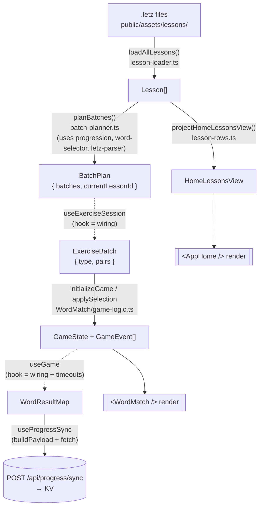
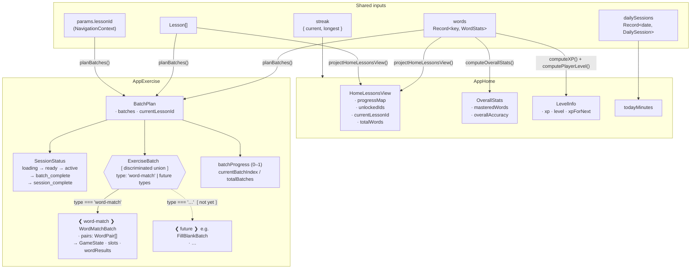
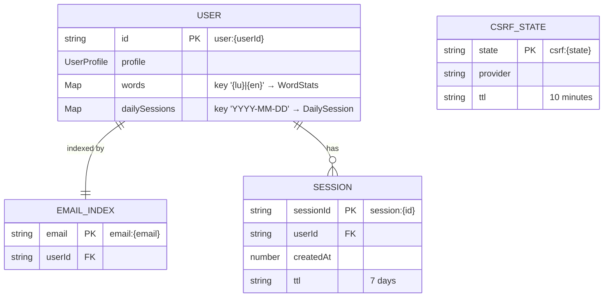

# CLAUDE.md

This file provides guidance to Claude Code (claude.ai/code) when working with code in this repository.

## Commands

```bash
npm run dev          # Start Vite dev server (includes local worker + KV emulation)
npm run build        # TypeScript compile + Vite build (tsc -b && vite build)
npm run lint         # ESLint
npm run preview      # Preview production build locally
npm run deploy       # Build and deploy to Cloudflare Pages
```

Tests run with `npx vitest run` (config in `vitest.config.ts`). Tests live under `tests/` mirroring the source tree. See **Testing** in Architecture below for what's covered and the no-mocks rule.

## What This App Is

**Roude Leiw** is a Luxembourgish language learning SPA. Users match Luxembourgish words to their English translations across levels (A1–C2) in themed lessons. There's also a "madness" mode that mixes all levels.

Deployed to Cloudflare Pages with a Cloudflare Worker backend for auth and persistence.

## Tech Stack

- React 19 + TypeScript (strict) + Tailwind CSS 4
- Vite 7 with `@cloudflare/vite-plugin` + Babel React Compiler (automatic memoization)
- Chevrotain 11 for parsing `.letz` lesson files
- Cloudflare Workers (backend API) + KV (persistence + sessions)
- Google OAuth 2.0 for authentication

## Project Structure

```
src/
├── main.tsx                          # App entry point (React root + providers)
├── App.tsx                           # Root component, page routing
├── App.css                           # Global app styles
├── index.css                         # Tailwind imports & theme config
│
├── context/                          # App-wide state (React Context)
│   ├── navigation.ts                 # Types: AppPages, NavigationContext
│   ├── NavigationContext.tsx         # Navigation provider
│   ├── useNavigation.ts              # Hook: useNavigation()
│   ├── auth.ts                       # Types: User, AuthState, AuthContextType
│   ├── AuthContext.tsx               # Auth provider (fetches /api/auth/me on mount)
│   └── useAuth.ts                    # Hook: useAuth()
│
├── page/                             # Top-level page components
│   ├── AppHome.tsx                   # Home/lesson selection page
│   └── AppExercise.tsx              # Exercise/game page (wires progress sync)
│
├── exercise/                         # Core game logic — producer pipeline
│   ├── use-exercise-session.ts       # Hook: thin wiring (load + dispatch only)
│   ├── lesson-loader.ts              # Producer: fetches manifest + .letz files → Lesson[]
│   ├── letz-parser.ts                # Facade: entriesToWordPairs()
│   ├── batch-planner.ts              # Producer: (lessons, userWords, target) → BatchPlan
│   ├── lesson-rows.ts                # Producer: (lessons, userWords) → HomeLessonsView
│   └── WordMatch/                    # Matching game
│       ├── index.tsx                 # Game UI (left/right columns)
│       ├── use-game.ts               # Game state machine + word result tracking
│       └── types.ts                  # WordPair, SlotState, GameState, WordResultMap
│
├── persistence/                      # Backend sync
│   └── hooks/
│       └── use-progress-sync.ts      # Syncs word results to /api/progress/sync
│
├── lib/                              # Shared libraries
│   ├── shuffle.ts                    # Single Fisher–Yates shuffle for the whole app
│   └── letz-parser/                  # Chevrotain parser implementation
│       ├── index.ts                  # Main exports
│       ├── lexer.ts                  # Tokenizer
│       ├── parser.ts                 # Grammar definition
│       └── visitor.ts                # AST visitor → structured data
│
└── ui/                               # Reusable UI components
    ├── index.ts                      # Barrel exports + color maps
    ├── AppWrapper.tsx                # App shell (header, mobile frame, wraps AuthProvider)
    ├── UserMenu.tsx                  # Sign-in button / user avatar
    ├── Button.tsx                    # Primary action button
    ├── Pill.tsx                      # Status pill (blanc/selected/success/fail)
    ├── FadingPill.tsx                # Pill with fade-out animation
    ├── ProgressBar.tsx               # Segmented batch progress indicator
    └── Popup.tsx                     # Modal (milestone & celebration variants)

worker/
├── index.ts                          # Worker entry point (thin: router wiring only)
├── router.ts                         # Table-driven router + session middleware
├── types.ts                          # Shared types (Env, UserData, KV shapes, API types)
├── handlers/
│   ├── auth.ts                       # Google OAuth handlers (initiate, callback, me, logout)
│   └── progress.ts                   # Progress sync handler
└── lib/
    ├── session.ts                    # KV session CRUD + cookie helpers
    ├── user.ts                       # KV user CRUD + pure data transforms (merge, streak)
    └── oauth/
        ├── types.ts                  # OAuthUserInfo type
        └── google.ts                 # Google OAuth (auth URL + code exchange)

public/
└── assets/lessons/
    ├── manifest.json                 # Lesson index by CEFR level
    └── A1/                           # Currently only A1 lessons exist
        ├── 01_greetings.letz
        ├── 02_numbers.letz
        ├── 03_family.letz
        ├── 04_food.letz
        └── 05_basic_words.letz
```

## Architecture

### Data Pipeline (read this first)

This codebase is organized as a **producer/consumer pipeline**. Each stage is a pure function that takes named, plain data and returns named, plain data. React, fetch, and KV writes only appear at the **edges**. Stages do not branch on edge cases the previous stage should have handled.

> ⚠️ **Keep this section accurate every session.** When you add, rename, move, or remove a producer or data shape, update the diagram and the rules below in the same change. This file is loaded as context for every Claude Code session — if it drifts, all future architectural decisions are made from a wrong map. Treat the diagram as load-bearing, not documentation.
>
> Diagrams use **Mermaid** (rendered by any markdown viewer that supports it: GitHub, VS Code preview, claude.ai). Use Mermaid for any new architectural diagram in this repo.
>
> **Pick the diagram type that fits the thing being shown.** Mermaid supports many — match the shape of the truth, don't force every diagram into `flowchart`:
> - **`flowchart`** — data flow, dependency graphs, pipelines (this section).
> - **`sequenceDiagram`** — request/response flows, OAuth handshakes, multi-actor protocols (e.g. the auth flow below would render well as one).
> - **`stateDiagram-v2`** — state machines (e.g. `SessionStatus`, `SlotState` transitions in `WordMatch`).
> - **`erDiagram`** — KV key shapes and their relationships (`user:{id}` ↔ `email:{email}` ↔ `session:{id}`).
> - **`classDiagram`** — type hierarchies or discriminated-union shapes.
> - **`gantt` / `timeline`** — milestones, release plans, incident timelines.
> - **`journey`** — user-facing flows from the user's perspective.
>
> A sequence diagram squeezed into a flowchart loses the temporal ordering; a state machine drawn as a flowchart hides the cyclic transitions. Choose for clarity, not consistency.



Legend: solid arrows = **pure producers** (no React, no I/O). Dashed arrows = **hook wiring** (React state, effects, refs). `[( )]` shapes are side-effect sinks; `[[ ]]` shapes are UI consumers.

Worker side mirrors the same shape: `worker/handlers/*` are thin routers; `worker/lib/user.ts` holds pure data transforms (`mergeWordResults`, `mergeDailySession`); KV is the sink.

### Rules for staying on-pipeline

When you add or change code, preserve the pattern:

1. **Hooks are wiring, not logic.** A `use*` hook should fetch, hold reducer/state, and dispatch — nothing else. If you're tempted to write `if`/`reduce`/`map` chains inside a hook body, extract a pure function and import it.
2. **Pure modules don't import React.** `src/exercise/*.ts` (excluding `use-*.ts`) and `src/lib/*` must not import from `react`, `react-dom`, or hooks. Test by running `grep -l "from \"react\"" src/exercise/*.ts` — should return only `use-*.ts`.
3. **Producers expose named types.** When a producer's output is non-trivial, export the type (`BatchPlan`, `HomeLessonsView`). The type *is* the contract between stages.
4. **Consumers don't re-derive.** If a UI component or hook indexes back into upstream data to figure out what to render (e.g., `pairs[slot.pairIndex]`), that's a smell — but not always worth fixing (see anti-dogmatism rule below).
5. **Side effects sit at the edges.** `loadAllLessons` (fetch), `useProgressSync` (POST), PostHog `capture`, KV writes — these belong at the entry/exit, not threaded through transformations. The one explicit exception is the synchronous PostHog calls inside `useGame`'s click handler; the ordering is intentional and commented.
6. **No `let`, no `for` loops.** Use `map`/`filter`/`reduce`/`flatMap`. The shuffle utility (`src/lib/shuffle.ts`) is the canonical example — there is exactly one shuffle in the app, import it.
7. **Worker handlers stay thin.** `worker/handlers/*.ts` should be: parse request → call pure transform from `worker/lib/*` → write KV → respond. Business logic lives in `worker/lib/`.

### Anti-dogmatism (equally important)

The pipeline is a **conceptual** model, not a syntax rule. Don't:

- Extract a one-line transformation into a producer file just to "make the pipeline explicit." Inline `Object.entries(x).map(...)` is fine.
- Force expression-only code. An internal `for`-equivalent built from `reduce` that's harder to read than a clear inline transform is worse, not better.
- Bundle every field a consumer happens to need into a "view object" producer. That's a viewmodel, and it metastasizes. `HomeLessonsView` is acceptable because it consolidates four redundant `useMemo`s over the same `(lessons, words)` deps; copying that pattern for any future page is not.
- Multiply intermediate allocations on hot paths. The game-state machine fires on every click; don't add layers there without measuring.

If a change feels like it's making the code longer to satisfy the pattern rather than shorter to express the intent, the pattern is wrong for that change.

### Screen Data Map

What each screen receives and from which pipeline stage. Update this when adding a new screen or a new data dependency.



`Lesson[]` is loaded independently on both screens via `loadAllLessons()` (cached by the browser). `words`/`streak`/`dailySessions` come from `useProgress()`, which abstracts over KV (auth) and localStorage (guest).

**Adding a new exercise type** — three touch points, nothing else:
1. `src/exercise/types.ts` — add `FillBlankBatch` and extend `ExerciseBatch = WordMatchBatch | FillBlankBatch`
2. `src/exercise/batch-planner.ts` — produce the new batch type where appropriate
3. `src/page/AppExercise.tsx` — add a `currentBatch?.type === 'fill-blank' && <FillBlank … />` branch alongside the existing `word-match` check

### Authentication

Google OAuth 2.0 via Cloudflare Worker. Flow:
1. User clicks "Sign in" → `GET /api/auth/google` → redirects to Google
2. Google redirects back to `/api/auth/callback` with authorization code
3. Worker exchanges code for user profile, upserts user in KV, creates session
4. Session ID stored in HttpOnly cookie (7-day TTL in KV)
5. Frontend fetches `GET /api/auth/me` on mount to restore auth state

Guest mode is preserved — the app works without login; auth is additive.

### Data Persistence

> ⚠️ **Keep this section accurate every session.** Treat the storage diagram, key shapes, and rules as load-bearing — same contract as the Data Pipeline section. When you add a new KV key, change a stored shape, alter merge semantics, or introduce a new client-side store, update this section in the same change.

#### Three storage tiers

| Tier              | Backed by              | Authoritative for                       | Lifecycle                          |
|-------------------|------------------------|-----------------------------------------|------------------------------------|
| **Server (KV)**   | Cloudflare KV          | Authenticated users (canonical state)   | Persisted; `user:*` permanent, `session:*` 7d, `csrf:*` 10m |
| **Client (localStorage)** | `localStorage["roude-leiw-guest"]` | Guest users only             | Until login (then migrated + cleared) or manual clear |
| **Client (in-memory)** | React Context (`AuthContext`) + `useSyncExternalStore` over localStorage | Current session view of either tier | Tab lifetime |

#### KV key shapes



Schemas live in `worker/types.ts` (`UserData`, `WordStats`, `DailySession`, `SessionData`). KV CRUD lives in `worker/lib/user.ts` and `worker/lib/session.ts`.

#### Core principles

1. **Derive, don't store.** Anything computable from `words` + `dailySessions` is computed on the fly:
   - **Streaks** ← `computeStreak(dailySessions, today)` in `worker/lib/user.ts`. No `streak` field.
   - **Lesson completion** ← `computeLessonProgress(lesson, words)` in `src/exercise/progression.ts`. No `completedLessons` field.
   - **Lesson unlock** ← `computeUnlockedLessonIds(lessons, words)`. No `unlockedLessons` field.
   - **Mastery class** (unseen/learning/struggling/mastered) ← `classifyWord(stats)`.
   - If you're tempted to add a new "summary" field to KV, ask whether it's a function of existing data. It almost always is.

2. **Send deltas, not snapshots.** The client posts a *batch* (`POST /api/progress/sync` body = what happened in this batch only). The server folds the delta into the cumulative `words` + `dailySessions`. Do not POST the full client snapshot.

3. **Same merge logic on both sides.** The same fold runs server-side (`mergeWordResults`/`mergeDailySession` in `worker/lib/user.ts`) and client-side for guest mode (`mergeWordStats`/`mergeDailySession` in `src/lib/stats-merge.ts`). The duplication is intentional — guest mode must produce a state that, when migrated, is byte-identical to what the server would have produced from the same deltas. **If you change one, change both** and verify with the existing tests in `tests/worker/lib/user.test.ts`.

4. **Single JSON blob per user.** `user:{userId}` holds `{ profile, words, dailySessions }` together. Don't split into separate keys ("user:{id}:words", "user:{id}:sessions") — the worker reads/writes atomically and the blob is small. This is a deliberate constraint, not a limitation to work around.

5. **Sync is fire-and-forget.** `useProgressSync` POSTs without awaiting a result for the UI flow. There's no retry, no idempotency key — if the request fails, the next batch's POST will include only that batch's delta, so failures lose data. Acceptable today (small data, infrequent loss); revisit if loss becomes user-visible.

6. **Sessions and CSRF use TTLs, not deletion sweeps.** Cloudflare KV `expirationTtl` handles cleanup. Don't write background jobs to expire stale rows.

7. **Guest store mirrors the auth schema.** `GuestData = { words, dailySessions }` is structurally a subset of `UserData` (no profile). This makes the guest→auth migration in `use-progress.ts` a straight POST of accumulated deltas, then `localStorage.removeItem`.

#### Client read/write pattern

`useProgress` (`src/persistence/hooks/use-progress.ts`) is the single read entry point — it returns `{ words, dailySessions, streak, syncBatch, isAuthenticated }` regardless of auth status. Consumers never branch on `auth.status` themselves; that's `useProgress`'s job.

The guest path uses `useSyncExternalStore` (`use-guest-progress.ts`) instead of `useState`/`useEffect`, because:
- Writes to localStorage are deliberately silent (no re-render storm during a batch).
- React re-reads only when explicitly notified via `refreshGuestProgress()` (called on navigation/session-end).
- Rationale: data updates fire on every match; rendering on every match would thrash. Render boundaries are coarser than data boundaries.

If you add a new client-side store: prefer `useSyncExternalStore` over `useState`+effects when writes are frequent or come from outside React.

#### Adding new persisted data — checklist

Before adding a new field to `UserData` or a new KV key:

- [ ] Can this be **derived** from existing data? If yes, write a pure function in `worker/lib/` or `src/exercise/progression.ts` instead.
- [ ] If new field added: update `worker/types.ts`, both merge functions (`worker/lib/user.ts` + `src/lib/stats-merge.ts`), the guest-store schema, and the migration path in `useProgress`.
- [ ] If new KV key added: update the er diagram above, set an explicit `expirationTtl` if not permanent, document the key prefix.
- [ ] Add a test in `tests/worker/lib/user.test.ts` covering the new merge case (these tests are the only guarantee that guest and auth paths stay in sync).

### Navigation

Context-based router (`src/context/`). Only two pages: `"home"` and `"exercise"`. Navigate by calling `navigateTo()` from `useNavigation()`.

### Exercise Session Flow

See **Data Pipeline** above for the full diagram. The orchestrator hook `src/exercise/use-exercise-session.ts` is intentionally thin: it loads lessons, calls `planBatches()` to produce a `BatchPlan`, and dispatches to the session reducer. All non-trivial logic lives in pure modules (`batch-planner.ts`, `progression.ts`, `word-selector.ts`).

Key ratios: 3 batches × 20 pairs each. The last batch shifts toward review (struggling/reinforcing/reviewing weighted higher than new). Per-word stats (`shown/correct/incorrect`) accumulate in `GameState.wordResults` and sync after each batch via `useProgressSync`.

### Game State Machine

`src/exercise/WordMatch/use-game.ts` manages the matching game. Key concepts:
- 5 visible slots per side (left: Luxembourgish, right: English)
- Slot states are a discriminated union: `active → selected → (match/fail) → fading → empty`
- Incorrect matches reset after 1 second
- When a round completes, unmatched pairs reshuffle into remaining fading slots
- `wordResults` tracked atomically in `GameState` — correct/incorrect/shown per word pair

### API Routes

| Method | Path | Auth | Description |
|--------|------|------|-------------|
| GET | `/api/auth/google` | No | Redirect to Google OAuth |
| GET | `/api/auth/callback` | No | OAuth callback → create session |
| GET | `/api/auth/me` | No | Current user + progress (or null) |
| POST | `/api/auth/logout` | Yes | Clear session |
| POST | `/api/progress/sync` | Yes | Merge word results + daily session |

### Lesson File Format (`.letz`)

Custom DSL parsed by Chevrotain. Files live at `public/assets/lessons/{level}/{filename}.letz`.

```
@lesson A1.01 "Basic Greetings"

Moien = good morning
Äddi = bye
Merci = thanks
```

### Testing

Tests run with **Vitest** (`npx vitest run`). The pipeline architecture means most of the app is testable as plain function calls — **the no-mocks rule below depends on staying on-pattern**. If you find yourself reaching for mocks, that's a signal the code under test should be split into a pure core + thin wiring.

**What's covered (130 tests):**

| Module                                      | Tests | Notes |
|---------------------------------------------|-------|-------|
| `src/exercise/WordMatch/game-logic.ts`      | 23    | initialize, applySelection (match/mismatch/edge cases), applyFadeComplete, applyClearFail, end-to-end accounting |
| `src/exercise/word-selector.ts`             | 15    | bucket classification, exclude keys, overflow priority, output shape |
| `src/exercise/batch-planner.ts`             | 12    | empty input, unlock filter, currentLessonId precedence, batch shape, last-batch ratio shift |
| `src/exercise/progression.ts`               | 22    | classifyWord, computeLessonProgress, computeUnlockedLessonIds, computeOverallStats |
| `src/exercise/session-reducer.ts`           | 16    | every action × every state |
| `src/lib/letz-parser.ts`                    | 9     | grammar, lesson directives, comments |
| `worker/lib/user.ts`                        | 19    | mergeWordResults, mergeDailySession, computeStreak |
| `worker/lib/session.ts`                     | 12    | session CRUD, cookie helpers |
| `tests/src/persistence/guest-progress.jsdom.test.tsx` | 2 (failing on `main`) | jsdom environment issue — preexisting, unrelated |

**No-mocks rule.** Tests should call pure functions with hand-built fixtures. Do not introduce `vi.mock()`, `vi.spyOn()`, fake fetch, fake KV, or React Testing Library unless a future change genuinely requires it. The existing tests achieve full coverage of business logic via plain function calls — replicate that style.

**What is intentionally NOT tested:**

- **Hooks (`use-game.ts`, `useExerciseSession`, `useProgress`, `useGuestProgress`)** — wiring only. Their bug surface is dependency arrays, ref lifecycles, and effect ordering, which are caught by the build + manual smoke test more cheaply than by `@testing-library/react` setups.
- **Worker handlers (`worker/handlers/*.ts`)** — thin routing over already-tested `worker/lib/*` transforms. Adding handler tests would require KV mocks for marginal coverage.
- **UI components (`src/ui/*`, `src/page/*`, `<WordMatch>`)** — render functions. Visual correctness lives in browser smoke tests, not unit tests.

**When adding a new producer or pure module, add tests in the same change.** If you can't write a test without mocking something, the code isn't on-pattern — fix the code, not the test.

**Test fixture conventions:**

- `s(shown, correct, incorrect)` for `WordStats` (see `progression.test.ts`)
- `lesson(id, ...pairs)` for `Lesson` (see `progression.test.ts`, `batch-planner.test.ts`)
- `slot.{active|selected|fail|fading|empty}(...)` for `SlotState` (see `game-logic.test.ts`)
- `cand(lu, en, lessonId)` for `CandidateItem` (see `word-selector.test.ts`)

Reuse these helpers; don't re-invent fixture shapes.

### Development

- Try to analyze several ideas and provide options to human to pick from.
- With every implementation check if it can be generalized and reused.

### Self-improvement

- Every time user makes a correction, the lessons learnt is added to the `.claude/lessons.md`, and check this file to prevent repeating mistakes.
